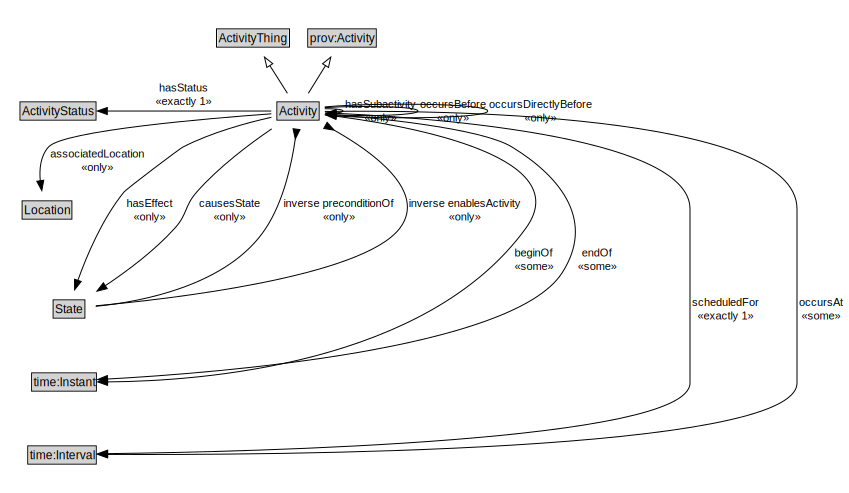

# Activity

<a href="diagrams/Activity.dot.svg">Open interactive Activity diagram</a>

## Formalization for Activity

| Property | Constraint |
|----------|------------|
| associatedLocation | all Location |
| beginOf | some time:Instant |
| causesState | all State |
| endOf | some time:Instant |
| hasEffect | all State |
| hasStatus | exactly 1 owl:Thing |
| hasSubactivity | all Activity |
| inverse enablesActivity | all State |
| inverse preconditionOf | all State |
| occursAt | some time:Interval |
| occursBefore | all Activity |
| occursDirectlyBefore | all Activity |
| scheduledFor | exactly 1 owl:Thing |
| subClassOf | ActivityThing |
| subClassOf | prov:Activity |

## Used by classes

| Class | Property |
|-------|----------|
| [Activity](Activity.md) | hasSubactivity |
| [Activity](Activity.md) | occursBefore |
| [Activity](Activity.md) | occursDirectlyBefore |
| [Agent (SpatialLocPattern)](Agent.md) | performs |
| [Recurring Event](RecurringEvent.md) | hasOccurrence |
| [State](State.md) | preconditionOf |
| [State](State.md) | enablesActivity |
| [State](State.md) | effectOf |
| [State](State.md) | causedByActivity |

