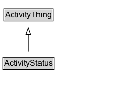

# ActivityStatus

## Diagram

=== "SVG (interactive)"

    <!-- Generated by graphviz version 14.0.2 (20251019.1705)
     -->
    <!-- Pages: 1 -->
    <svg width="172pt" height="132pt"
     viewBox="0.00 0.00 172.00 132.00" xmlns="http://www.w3.org/2000/svg" xmlns:xlink="http://www.w3.org/1999/xlink">
    <g id="graph0" class="graph" transform="scale(1 1) rotate(0) translate(4 128)">
    <polygon fill="white" stroke="none" points="-4,4 -4,-128 168,-128 168,4 -4,4"/>
    <g id="clust2" class="cluster">
    <title>cluster_associated</title>
    </g>
    <!-- ActivityStatus -->
    <g id="node1" class="node">
    <title>ActivityStatus</title>
    <g id="a_node1"><a xlink:href="../ActivityStatus" xlink:title="&lt;TABLE&gt;">
    <polygon fill="lightgray" stroke="none" points="1,-81.88 1,-98.12 75,-98.12 75,-81.88 1,-81.88"/>
    <text xml:space="preserve" text-anchor="start" x="2" y="-85.72" font-family="Arial" font-size="12.00">ActivityStatus</text>
    <polygon fill="none" stroke="black" points="0,-80.88 0,-99.12 76,-99.12 76,-80.88 0,-80.88"/>
    </a>
    </g>
    </g>
    <!-- ActivityThing -->
    <g id="node3" class="node">
    <title>ActivityThing</title>
    <g id="a_node3"><a xlink:href="../ActivityThing" xlink:title="&lt;TABLE&gt;">
    <polygon fill="lightgray" stroke="none" points="2.5,-9.88 2.5,-26.12 73.5,-26.12 73.5,-9.88 2.5,-9.88"/>
    <text xml:space="preserve" text-anchor="start" x="3.5" y="-13.72" font-family="Arial" font-size="12.00">ActivityThing</text>
    <polygon fill="none" stroke="black" points="1.5,-8.88 1.5,-27.12 74.5,-27.12 74.5,-8.88 1.5,-8.88"/>
    </a>
    </g>
    </g>
    <!-- ActivityStatus&#45;&gt;ActivityThing -->
    <g id="edge1" class="edge">
    <title>ActivityStatus&#45;&gt;ActivityThing</title>
    <path fill="none" stroke="black" d="M38,-72.05C38,-64.57 38,-55.58 38,-47.14"/>
    <polygon fill="none" stroke="black" points="41.5,-47.3 38,-37.3 34.5,-47.3 41.5,-47.3"/>
    </g>
    <!-- Invis -->
    </g>
    </svg>

=== "PNG"

    

## Formalization for ActivityStatus

| Property | Constraint |
|----------|------------|
| subClassOf | [ActivityThing](ActivityThing.md) |

