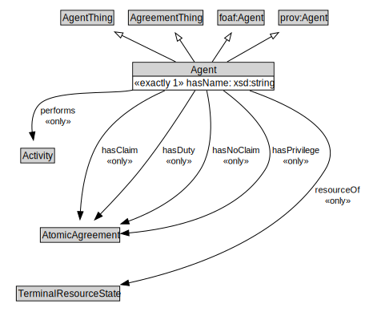

# Agent

<a href="diagrams/Agent.dot.svg">Open interactive Agent diagram</a>

## Specializations of Agent

| Class | Description |
|-------|-------------|
| [Organization](Organization.md) |  |

## Formalization for Agent

| Property | Constraint |
|----------|------------|
| hasClaim | all AtomicAgreement |
| hasDuty | all AtomicAgreement |
| hasName | exactly 1 owl:Thing |
| hasNoClaim | all AtomicAgreement |
| hasPrivilege | all AtomicAgreement |
| performs | all Activity |
| resourceOf | all TerminalResourceState |
| subClassOf | AgentThing |
| subClassOf | foaf:Agent |
| subClassOf | prov:Agent |
| subClassOf | AgreementThing |

