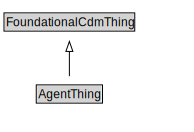

# AgentThing

<a href="diagrams/AgentThing.dot.svg">Open interactive AgentThing diagram</a>

## Specializations of AgentThing

| Class | Description |
|-------|-------------|
| [Agent (SpatialLocPattern)](Agent.md) |  |
| [Organization](Organization.md) |  |

## Formalization for AgentThing

| Property | Constraint |
|----------|------------|
| subClassOf | FoundationalCdmThing |

