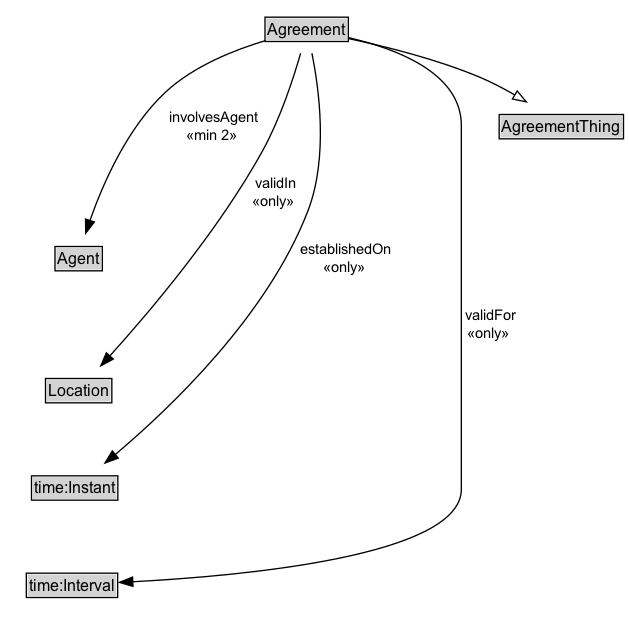

# Agreement

## Diagram

=== "SVG (interactive)"

    <!-- Generated by graphviz version 14.0.2 (20251019.1705)
     -->
    <!-- Pages: 1 -->
    <svg width="472pt" height="477pt"
     viewBox="0.00 0.00 472.00 477.00" xmlns="http://www.w3.org/2000/svg" xmlns:xlink="http://www.w3.org/1999/xlink">
    <g id="graph0" class="graph" transform="scale(1 1) rotate(0) translate(4 473)">
    <polygon fill="white" stroke="none" points="-4,4 -4,-473 467.62,-473 467.62,4 -4,4"/>
    <g id="clust2" class="cluster">
    <title>cluster_associated</title>
    </g>
    <!-- Agreement -->
    <g id="node1" class="node">
    <title>Agreement</title>
    <g id="a_node1"><a xlink:href="../Agreement" xlink:title="&lt;TABLE&gt;">
    <polygon fill="lightgray" stroke="none" points="195.75,-442.88 195.75,-459.12 256.25,-459.12 256.25,-442.88 195.75,-442.88"/>
    <text xml:space="preserve" text-anchor="start" x="196.75" y="-446.73" font-family="Arial" font-size="12.00">Agreement</text>
    <polygon fill="none" stroke="black" points="194.75,-441.88 194.75,-460.12 257.25,-460.12 257.25,-441.88 194.75,-441.88"/>
    </a>
    </g>
    </g>
    <!-- Invis -->
    <!-- Agreement&#45;&gt;Invis -->
    <!-- Agent -->
    <g id="node3" class="node">
    <title>Agent</title>
    <g id="a_node3"><a xlink:href="../Agent" xlink:title="&lt;TABLE&gt;">
    <polygon fill="lightgray" stroke="none" points="38.25,-270.88 38.25,-287.12 71.75,-287.12 71.75,-270.88 38.25,-270.88"/>
    <text xml:space="preserve" text-anchor="start" x="39.25" y="-274.73" font-family="Arial" font-size="12.00">Agent</text>
    <polygon fill="none" stroke="black" points="37.25,-269.88 37.25,-288.12 72.75,-288.12 72.75,-269.88 37.25,-269.88"/>
    </a>
    </g>
    </g>
    <!-- Agreement&#45;&gt;Agent -->
    <g id="edge10" class="edge">
    <title>Agreement&#45;&gt;Agent</title>
    <path fill="none" stroke="black" d="M195.12,-442.55C172.2,-435.72 141.38,-423.62 120.25,-404 91.55,-377.35 73.14,-335.18 63.43,-307.54"/>
    <polygon fill="black" stroke="black" points="66.77,-306.49 60.28,-298.12 60.13,-308.71 66.77,-306.49"/>
    <text xml:space="preserve" text-anchor="middle" x="156.62" y="-381.05" font-family="Arial" font-size="11.00"> involvesAgent </text>
    <text xml:space="preserve" text-anchor="middle" x="156.62" y="-367.55" font-family="Arial" font-size="11.00"> «min 2» &#160;</text>
    </g>
    <!-- Location -->
    <g id="node4" class="node">
    <title>Location</title>
    <g id="a_node4"><a xlink:href="../Location" xlink:title="&lt;TABLE&gt;">
    <polygon fill="lightgray" stroke="none" points="31.12,-171.88 31.12,-188.12 78.88,-188.12 78.88,-171.88 31.12,-171.88"/>
    <text xml:space="preserve" text-anchor="start" x="32.12" y="-175.72" font-family="Arial" font-size="12.00">Location</text>
    <polygon fill="none" stroke="black" points="30.12,-170.88 30.12,-189.12 79.88,-189.12 79.88,-170.88 30.12,-170.88"/>
    </a>
    </g>
    </g>
    <!-- Agreement&#45;&gt;Location -->
    <g id="edge9" class="edge">
    <title>Agreement&#45;&gt;Location</title>
    <path fill="none" stroke="black" d="M221.48,-433.08C216.14,-414.48 206.26,-384.04 193,-360 159.94,-300.07 107.87,-238.72 78.04,-205.69"/>
    <polygon fill="black" stroke="black" points="80.95,-203.69 71.63,-198.66 75.78,-208.41 80.95,-203.69"/>
    <text xml:space="preserve" text-anchor="middle" x="202.63" y="-331.55" font-family="Arial" font-size="11.00"> validIn </text>
    <text xml:space="preserve" text-anchor="middle" x="202.63" y="-318.05" font-family="Arial" font-size="11.00"> «only» &#160;</text>
    </g>
    <!-- time_Instant -->
    <g id="node5" class="node">
    <title>time_Instant</title>
    <g id="a_node5"><a xlink:href="https://w3id.org/citydata/imported/time/latest/Instant" xlink:title="&lt;TABLE&gt;">
    <polygon fill="lightgray" stroke="none" points="20.62,-98.88 20.62,-115.12 83.38,-115.12 83.38,-98.88 20.62,-98.88"/>
    <text xml:space="preserve" text-anchor="start" x="21.62" y="-102.72" font-family="Arial" font-size="12.00">time:Instant</text>
    <polygon fill="none" stroke="black" points="19.62,-97.88 19.62,-116.12 84.38,-116.12 84.38,-97.88 19.62,-97.88"/>
    </a>
    </g>
    </g>
    <!-- Agreement&#45;&gt;time_Instant -->
    <g id="edge7" class="edge">
    <title>Agreement&#45;&gt;time_Instant</title>
    <path fill="none" stroke="black" d="M229.94,-433.1C235.24,-406.83 242.35,-355.05 227,-315 196.95,-236.6 123.79,-166.94 82.2,-131.92"/>
    <polygon fill="black" stroke="black" points="84.68,-129.43 74.75,-125.74 80.22,-134.82 84.68,-129.43"/>
    <text xml:space="preserve" text-anchor="middle" x="255.64" y="-282.05" font-family="Arial" font-size="11.00"> establishedOn </text>
    <text xml:space="preserve" text-anchor="middle" x="255.64" y="-268.55" font-family="Arial" font-size="11.00"> «only» &#160;</text>
    </g>
    <!-- time_Interval -->
    <g id="node6" class="node">
    <title>time_Interval</title>
    <g id="a_node6"><a xlink:href="https://w3id.org/citydata/imported/time/latest/Interval" xlink:title="&lt;TABLE&gt;">
    <polygon fill="lightgray" stroke="none" points="16.75,-25.88 16.75,-42.12 83.25,-42.12 83.25,-25.88 16.75,-25.88"/>
    <text xml:space="preserve" text-anchor="start" x="17.75" y="-29.73" font-family="Arial" font-size="12.00">time:Interval</text>
    <polygon fill="none" stroke="black" points="15.75,-24.88 15.75,-43.12 84.25,-43.12 84.25,-24.88 15.75,-24.88"/>
    </a>
    </g>
    </g>
    <!-- Agreement&#45;&gt;time_Interval -->
    <g id="edge8" class="edge">
    <title>Agreement&#45;&gt;time_Interval</title>
    <path fill="none" stroke="black" d="M257.09,-444.8C291.45,-437.06 342,-418.9 342,-379 342,-379 342,-379 342,-106 342,-55.9 177.66,-41.01 95.55,-36.7"/>
    <polygon fill="black" stroke="black" points="95.74,-33.2 85.58,-36.21 95.4,-40.2 95.74,-33.2"/>
    <text xml:space="preserve" text-anchor="middle" x="364.12" y="-232.55" font-family="Arial" font-size="11.00"> validFor </text>
    <text xml:space="preserve" text-anchor="middle" x="364.12" y="-219.05" font-family="Arial" font-size="11.00"> «only» &#160;</text>
    </g>
    <!-- AgreementThing -->
    <g id="node7" class="node">
    <title>AgreementThing</title>
    <g id="a_node7"><a xlink:href="../AgreementThing" xlink:title="&lt;TABLE&gt;">
    <polygon fill="lightgray" stroke="none" points="371.38,-369.88 371.38,-386.12 462.62,-386.12 462.62,-369.88 371.38,-369.88"/>
    <text xml:space="preserve" text-anchor="start" x="372.38" y="-373.73" font-family="Arial" font-size="12.00">AgreementThing</text>
    <polygon fill="none" stroke="black" points="370.38,-368.88 370.38,-387.12 463.62,-387.12 463.62,-368.88 370.38,-368.88"/>
    </a>
    </g>
    </g>
    <!-- Agreement&#45;&gt;AgreementThing -->
    <g id="edge1" class="edge">
    <title>Agreement&#45;&gt;AgreementThing</title>
    <path fill="none" stroke="black" d="M257.25,-444.07C284.08,-438.4 323.47,-428.68 356,-415 364.78,-411.31 373.84,-406.55 382.2,-401.71"/>
    <polygon fill="none" stroke="black" points="383.91,-404.77 390.68,-396.62 380.31,-398.76 383.91,-404.77"/>
    </g>
    <!-- Invis&#45;&gt;Agent -->
    <!-- Agent&#45;&gt;Location -->
    <!-- Location&#45;&gt;time_Instant -->
    <!-- time_Instant&#45;&gt;time_Interval -->
    </g>
    </svg>

=== "PNG"

    

## Specializations of Agreement

| Class | Description |
|-------|-------------|
| [Atomic Agreement](AtomicAgreement.md) |  |
| [Complex Agreement](ComplexAgreement.md) |  |
| [Conjunctive Agreement](ConjunctiveAgreement.md) |  |
| [Disjunctive Agreement](DisjunctiveAgreement.md) |  |

## Formalization for Agreement

| Property | Constraint |
|----------|------------|
| [establishedOn](https://w3id.org/citydata/part1/v1/establishedOn) | only [time:Instant](https://w3id.org/citydata/imported/time/Instant) |
| [involvesAgent](https://w3id.org/citydata/part1/v1/involvesAgent) | min 2 |
| [validFor](https://w3id.org/citydata/part1/v1/validFor) | only [time:Interval](https://w3id.org/citydata/imported/time/Interval) |
| [validIn](https://w3id.org/citydata/part1/v1/validIn) | only [Location](Location.md) |
| subClassOf | [AgreementThing](AgreementThing.md) |

