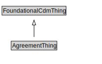

# AgreementThing

<a href="diagrams/AgreementThing.dot.svg">Open interactive AgreementThing diagram</a>

## Specializations of AgreementThing

| Class | Description |
|-------|-------------|
| [Agent (SpatialLocPattern)](Agent.md) |  |
| [Agreement](Agreement.md) |  |
| [Conjunctive Agreement](ConjunctiveAgreement.md) |  |
| [Disjunctive Agreement](DisjunctiveAgreement.md) |  |
| [Organization](Organization.md) |  |

## Formalization for AgreementThing

| Property | Constraint |
|----------|------------|
| subClassOf | FoundationalCdmThing |

