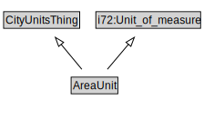

# AreaUnit

<a href="diagrams/AreaUnit.dot.svg">Open interactive AreaUnit diagram</a>

## Formalization for AreaUnit

| Property | Constraint |
|----------|------------|
| subClassOf | CityUnitsThing |
| subClassOf | i72:Unit_of_measure |

