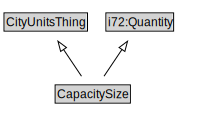

# CapacitySize

<a href="diagrams/CapacitySize.dot.svg">Open interactive CapacitySize diagram</a>

## Formalization for CapacitySize

| Property | Constraint |
|----------|------------|
| i72:cardinality_of | exactly 1 owl:Thing |
| i72:value | all ComplexExpr |
| subClassOf | CityUnitsThing |
| subClassOf | i72:Quantity |

