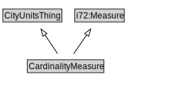

# CardinalityMeasure

<a href="diagrams/CardinalityMeasure.dot.svg">Open interactive CardinalityMeasure diagram</a>

## Formalization for CardinalityMeasure

| Property | Constraint |
|----------|------------|
| i72:unit_of_measure | all i72:Cardinality_unit |
| subClassOf | CityUnitsThing |
| subClassOf | i72:Measure |

