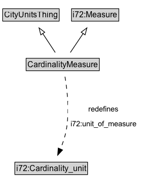

# CardinalityMeasure

## Diagram

=== "SVG (interactive)"

    <!-- Generated by graphviz version 14.0.2 (20251019.1705)
     -->
    <!-- Pages: 1 -->
    <svg width="239pt" height="132pt"
     viewBox="0.00 0.00 239.00 132.00" xmlns="http://www.w3.org/2000/svg" xmlns:xlink="http://www.w3.org/1999/xlink">
    <g id="graph0" class="graph" transform="scale(1 1) rotate(0) translate(4 128)">
    <polygon fill="white" stroke="none" points="-4,4 -4,-128 234.75,-128 234.75,4 -4,4"/>
    <g id="clust2" class="cluster">
    <title>cluster_associated</title>
    </g>
    <!-- CardinalityMeasure -->
    <g id="node1" class="node">
    <title>CardinalityMeasure</title>
    <g id="a_node1"><a xlink:href="../CardinalityMeasure" xlink:title="&lt;TABLE&gt;">
    <polygon fill="lightgray" stroke="none" points="35.62,-81.88 35.62,-98.12 141.88,-98.12 141.88,-81.88 35.62,-81.88"/>
    <text xml:space="preserve" text-anchor="start" x="36.62" y="-85.72" font-family="Arial" font-size="12.00">CardinalityMeasure</text>
    <polygon fill="none" stroke="black" points="34.62,-80.88 34.62,-99.12 142.88,-99.12 142.88,-80.88 34.62,-80.88"/>
    </a>
    </g>
    </g>
    <!-- CityUnitsThing -->
    <g id="node3" class="node">
    <title>CityUnitsThing</title>
    <g id="a_node3"><a xlink:href="../CityUnitsThing" xlink:title="&lt;TABLE&gt;">
    <polygon fill="lightgray" stroke="none" points="1,-9.88 1,-26.12 82.5,-26.12 82.5,-9.88 1,-9.88"/>
    <text xml:space="preserve" text-anchor="start" x="2" y="-13.72" font-family="Arial" font-size="12.00">CityUnitsThing</text>
    <polygon fill="none" stroke="black" points="0,-8.88 0,-27.12 83.5,-27.12 83.5,-8.88 0,-8.88"/>
    </a>
    </g>
    </g>
    <!-- CardinalityMeasure&#45;&gt;CityUnitsThing -->
    <g id="edge1" class="edge">
    <title>CardinalityMeasure&#45;&gt;CityUnitsThing</title>
    <path fill="none" stroke="black" d="M77.37,-72.05C71.95,-63.97 65.33,-54.12 59.28,-45.11"/>
    <polygon fill="none" stroke="black" points="62.35,-43.4 53.87,-37.05 56.53,-47.3 62.35,-43.4"/>
    </g>
    <!-- i72_Measure -->
    <g id="node4" class="node">
    <title>i72_Measure</title>
    <g id="a_node4"><a xlink:href="https://w3id.org/citydata/21972/v1/Measure" xlink:title="&lt;TABLE&gt;">
    <polygon fill="lightgray" stroke="none" points="102.75,-9.88 102.75,-26.12 170.75,-26.12 170.75,-9.88 102.75,-9.88"/>
    <text xml:space="preserve" text-anchor="start" x="103.75" y="-13.72" font-family="Arial" font-size="12.00">i72:Measure</text>
    <polygon fill="none" stroke="black" points="101.75,-8.88 101.75,-27.12 171.75,-27.12 171.75,-8.88 101.75,-8.88"/>
    </a>
    </g>
    </g>
    <!-- CardinalityMeasure&#45;&gt;i72_Measure -->
    <g id="edge2" class="edge">
    <title>CardinalityMeasure&#45;&gt;i72_Measure</title>
    <path fill="none" stroke="black" d="M100.37,-72.05C105.91,-63.97 112.67,-54.12 118.84,-45.11"/>
    <polygon fill="none" stroke="black" points="121.61,-47.26 124.38,-37.04 115.84,-43.31 121.61,-47.26"/>
    </g>
    <!-- Invis -->
    </g>
    </svg>

=== "PNG"

    

## Formalization for CardinalityMeasure

| Property | Constraint |
|----------|------------|
| [i72:unit_of_measure](https://w3id.org/citydata/21972/v1/unit_of_measure) | only [i72:Cardinality_unit](https://w3id.org/citydata/21972/v1/Cardinality_unit) |
| subClassOf | [CityUnitsThing](CityUnitsThing.md) |
| subClassOf | [i72:Measure](https://w3id.org/citydata/21972/v1/Measure) |

