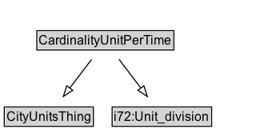

# CardinalityUnitPerTime

## Diagram

=== "SVG (interactive)"

    <!-- Generated by graphviz version 14.0.2 (20251019.1705)
     -->
    <!-- Pages: 1 -->
    <svg width="255pt" height="132pt"
     viewBox="0.00 0.00 255.00 132.00" xmlns="http://www.w3.org/2000/svg" xmlns:xlink="http://www.w3.org/1999/xlink">
    <g id="graph0" class="graph" transform="scale(1 1) rotate(0) translate(4 128)">
    <polygon fill="white" stroke="none" points="-4,4 -4,-128 250.75,-128 250.75,4 -4,4"/>
    <g id="clust2" class="cluster">
    <title>cluster_associated</title>
    </g>
    <!-- CardinalityUnitPerTime -->
    <g id="node1" class="node">
    <title>CardinalityUnitPerTime</title>
    <g id="a_node1"><a xlink:href="../CardinalityUnitPerTime" xlink:title="&lt;TABLE&gt;">
    <polygon fill="lightgray" stroke="none" points="31.5,-81.88 31.5,-98.12 158,-98.12 158,-81.88 31.5,-81.88"/>
    <text xml:space="preserve" text-anchor="start" x="32.5" y="-85.72" font-family="Arial" font-size="12.00">CardinalityUnitPerTime</text>
    <polygon fill="none" stroke="black" points="30.5,-80.88 30.5,-99.12 159,-99.12 159,-80.88 30.5,-80.88"/>
    </a>
    </g>
    </g>
    <!-- CityUnitsThing -->
    <g id="node3" class="node">
    <title>CityUnitsThing</title>
    <g id="a_node3"><a xlink:href="../CityUnitsThing" xlink:title="&lt;TABLE&gt;">
    <polygon fill="lightgray" stroke="none" points="1,-9.88 1,-26.12 82.5,-26.12 82.5,-9.88 1,-9.88"/>
    <text xml:space="preserve" text-anchor="start" x="2" y="-13.72" font-family="Arial" font-size="12.00">CityUnitsThing</text>
    <polygon fill="none" stroke="black" points="0,-8.88 0,-27.12 83.5,-27.12 83.5,-8.88 0,-8.88"/>
    </a>
    </g>
    </g>
    <!-- CardinalityUnitPerTime&#45;&gt;CityUnitsThing -->
    <g id="edge1" class="edge">
    <title>CardinalityUnitPerTime&#45;&gt;CityUnitsThing</title>
    <path fill="none" stroke="black" d="M81.92,-72.05C75.74,-63.89 68.18,-53.91 61.3,-44.82"/>
    <polygon fill="none" stroke="black" points="64.2,-42.86 55.38,-37 58.62,-47.08 64.2,-42.86"/>
    </g>
    <!-- i72_Unit_division -->
    <g id="node4" class="node">
    <title>i72_Unit_division</title>
    <g id="a_node4"><a xlink:href="https://w3id.org/citydata/21972/v1/Unit_division" xlink:title="&lt;TABLE&gt;">
    <polygon fill="lightgray" stroke="none" points="102.12,-9.88 102.12,-26.12 193.38,-26.12 193.38,-9.88 102.12,-9.88"/>
    <text xml:space="preserve" text-anchor="start" x="103.12" y="-13.72" font-family="Arial" font-size="12.00">i72:Unit_division</text>
    <polygon fill="none" stroke="black" points="101.12,-8.88 101.12,-27.12 194.38,-27.12 194.38,-8.88 101.12,-8.88"/>
    </a>
    </g>
    </g>
    <!-- CardinalityUnitPerTime&#45;&gt;i72_Unit_division -->
    <g id="edge2" class="edge">
    <title>CardinalityUnitPerTime&#45;&gt;i72_Unit_division</title>
    <path fill="none" stroke="black" d="M107.58,-72.05C113.76,-63.89 121.32,-53.91 128.2,-44.82"/>
    <polygon fill="none" stroke="black" points="130.88,-47.08 134.12,-37 125.3,-42.86 130.88,-47.08"/>
    </g>
    <!-- Invis -->
    </g>
    </svg>

=== "PNG"

    

## Formalization for CardinalityUnitPerTime

| Property | Constraint |
|----------|------------|
| [i72:denominator](https://w3id.org/citydata/21972/v1/denominator) | only [TimeUnit](TimeUnit.md) |
| [i72:numerator](https://w3id.org/citydata/21972/v1/numerator) | only [i72:Cardinality_unit](https://w3id.org/citydata/21972/v1/Cardinality_unit) |
| subClassOf | [CityUnitsThing](CityUnitsThing.md) |
| subClassOf | [i72:Unit_division](https://w3id.org/citydata/21972/v1/Unit_division) |

