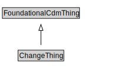

# ChangeThing

<a href="diagrams/ChangeThing.dot.svg">Open interactive ChangeThing diagram</a>

## Specializations of ChangeThing

| Class | Description |
|-------|-------------|
| [First Manifestation](FirstManifestation.md) |  |
| [Manifestation](Manifestation.md) |  |
| [Planned Allocation](PlannedAllocation.md) |  |

## Formalization for ChangeThing

| Property | Constraint |
|----------|------------|
| subClassOf | FoundationalCdmThing |

