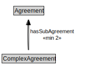

# ComplexAgreement

<a href="diagrams/ComplexAgreement.dot.svg">Open interactive ComplexAgreement diagram</a>

## Specializations of ComplexAgreement

| Class | Description |
|-------|-------------|
| [Conjunctive Agreement](ConjunctiveAgreement.md) |  |
| [Disjunctive Agreement](DisjunctiveAgreement.md) |  |

## Formalization for ComplexAgreement

| Property | Constraint |
|----------|------------|
| hasSubAgreement | min 2 owl:Thing |
| subClassOf | Agreement |

