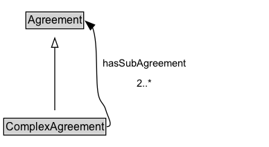

# ComplexAgreement

## Diagram

=== "SVG (interactive)"

    <!-- Generated by graphviz version 14.0.2 (20251019.1705)
     -->
    <!-- Pages: 1 -->
    <svg width="206pt" height="159pt"
     viewBox="0.00 0.00 206.00 159.00" xmlns="http://www.w3.org/2000/svg" xmlns:xlink="http://www.w3.org/1999/xlink">
    <g id="graph0" class="graph" transform="scale(1 1) rotate(0) translate(4 155)">
    <polygon fill="white" stroke="none" points="-4,4 -4,-155 202.25,-155 202.25,4 -4,4"/>
    <g id="clust2" class="cluster">
    <title>cluster_associated</title>
    </g>
    <!-- ComplexAgreement -->
    <g id="node1" class="node">
    <title>ComplexAgreement</title>
    <g id="a_node1"><a xlink:href="../ComplexAgreement" xlink:title="&lt;TABLE&gt;">
    <polygon fill="lightgray" stroke="none" points="1,-108.88 1,-125.12 109.5,-125.12 109.5,-108.88 1,-108.88"/>
    <text xml:space="preserve" text-anchor="start" x="2" y="-112.72" font-family="Arial" font-size="12.00">ComplexAgreement</text>
    <polygon fill="none" stroke="black" points="0,-107.88 0,-126.12 110.5,-126.12 110.5,-107.88 0,-107.88"/>
    </a>
    </g>
    </g>
    <!-- Agreement -->
    <g id="node3" class="node">
    <title>Agreement</title>
    <g id="a_node3"><a xlink:href="../Agreement" xlink:title="&lt;TABLE&gt;">
    <polygon fill="lightgray" stroke="none" points="25,-9.88 25,-26.12 85.5,-26.12 85.5,-9.88 25,-9.88"/>
    <text xml:space="preserve" text-anchor="start" x="26" y="-13.72" font-family="Arial" font-size="12.00">Agreement</text>
    <polygon fill="none" stroke="black" points="24,-8.88 24,-27.12 86.5,-27.12 86.5,-8.88 24,-8.88"/>
    </a>
    </g>
    </g>
    <!-- ComplexAgreement&#45;&gt;Agreement -->
    <g id="edge1" class="edge">
    <title>ComplexAgreement&#45;&gt;Agreement</title>
    <path fill="none" stroke="black" d="M54.1,-99.27C53.75,-93.49 53.42,-86.96 53.25,-81 52.91,-69 52.91,-66 53.25,-54 53.31,-51.76 53.4,-49.45 53.5,-47.12"/>
    <polygon fill="none" stroke="black" points="56.99,-47.41 54.02,-37.24 50,-47.04 56.99,-47.41"/>
    </g>
    <!-- ComplexAgreement&#45;&gt;Agreement -->
    <g id="edge2" class="edge">
    <title>ComplexAgreement&#45;&gt;Agreement</title>
    <path fill="none" stroke="black" d="M55.25,-99.1C55.25,-84.78 55.25,-63.93 55.25,-47.1"/>
    <polygon fill="black" stroke="black" points="58.75,-47.22 55.25,-37.22 51.75,-47.22 58.75,-47.22"/>
    <text xml:space="preserve" text-anchor="middle" x="103.25" y="-70.55" font-family="Arial" font-size="11.00"> hasSubAgreement </text>
    <text xml:space="preserve" text-anchor="middle" x="103.25" y="-57.05" font-family="Arial" font-size="11.00"> «min 2» &#160;</text>
    </g>
    <!-- Invis -->
    </g>
    </svg>

=== "PNG"

    

## Specializations of ComplexAgreement

| Class | Description |
|-------|-------------|
| [Conjunctive Agreement](ConjunctiveAgreement.md) |  |
| [Disjunctive Agreement](DisjunctiveAgreement.md) |  |

## Formalization for ComplexAgreement

| Property | Constraint |
|----------|------------|
| [hasSubAgreement](https://w3id.org/citydata/part1/v1/hasSubAgreement) | min 2 |
| subClassOf | [Agreement](Agreement.md) |

