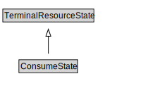

# ConsumeState

<a href="diagrams/ConsumeState.dot.svg">Open interactive ConsumeState diagram</a>

## Formalization for ConsumeState

| Property | Constraint |
|----------|------------|
| subClassOf | TerminalResourceState |

