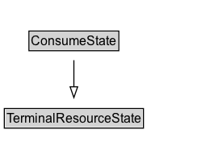

# ConsumeState

## Diagram

=== "SVG (interactive)"

    <!-- Generated by graphviz version 14.0.2 (20251019.1705)
     -->
    <!-- Pages: 1 -->
    <svg width="203pt" height="132pt"
     viewBox="0.00 0.00 203.00 132.00" xmlns="http://www.w3.org/2000/svg" xmlns:xlink="http://www.w3.org/1999/xlink">
    <g id="graph0" class="graph" transform="scale(1 1) rotate(0) translate(4 128)">
    <polygon fill="white" stroke="none" points="-4,4 -4,-128 198.62,-128 198.62,4 -4,4"/>
    <g id="clust2" class="cluster">
    <title>cluster_associated</title>
    </g>
    <!-- ConsumeState -->
    <g id="node1" class="node">
    <title>ConsumeState</title>
    <g id="a_node1"><a xlink:href="../ConsumeState" xlink:title="&lt;TABLE&gt;">
    <polygon fill="lightgray" stroke="none" points="23.88,-81.88 23.88,-98.12 105.38,-98.12 105.38,-81.88 23.88,-81.88"/>
    <text xml:space="preserve" text-anchor="start" x="24.88" y="-85.72" font-family="Arial" font-size="12.00">ConsumeState</text>
    <polygon fill="none" stroke="black" points="22.88,-80.88 22.88,-99.12 106.38,-99.12 106.38,-80.88 22.88,-80.88"/>
    </a>
    </g>
    </g>
    <!-- TerminalResourceState -->
    <g id="node3" class="node">
    <title>TerminalResourceState</title>
    <g id="a_node3"><a xlink:href="../TerminalResourceState" xlink:title="&lt;TABLE&gt;">
    <polygon fill="lightgray" stroke="none" points="1,-9.88 1,-26.12 128.25,-26.12 128.25,-9.88 1,-9.88"/>
    <text xml:space="preserve" text-anchor="start" x="2" y="-13.72" font-family="Arial" font-size="12.00">TerminalResourceState</text>
    <polygon fill="none" stroke="black" points="0,-8.88 0,-27.12 129.25,-27.12 129.25,-8.88 0,-8.88"/>
    </a>
    </g>
    </g>
    <!-- ConsumeState&#45;&gt;TerminalResourceState -->
    <g id="edge1" class="edge">
    <title>ConsumeState&#45;&gt;TerminalResourceState</title>
    <path fill="none" stroke="black" d="M64.62,-72.05C64.62,-64.57 64.62,-55.58 64.62,-47.14"/>
    <polygon fill="none" stroke="black" points="68.13,-47.3 64.63,-37.3 61.13,-47.3 68.13,-47.3"/>
    </g>
    <!-- Invis -->
    </g>
    </svg>

=== "PNG"

    

## Formalization for ConsumeState

| Property | Constraint |
|----------|------------|
| subClassOf | [TerminalResourceState](TerminalResourceState.md) |

