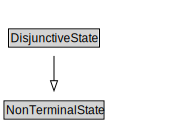

# DisjunctiveState

<a href="diagrams/DisjunctiveState.dot.svg">Open interactive DisjunctiveState diagram</a>

## Formalization for DisjunctiveState

| Property | Constraint |
|----------|------------|
| subClassOf | NonTerminalState |

