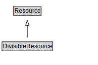

# DivisibleResource

<a href="diagrams/DivisibleResource.dot.svg">Open interactive DivisibleResource diagram</a>

## Formalization for DivisibleResource

| Property | Constraint |
|----------|------------|
| subClassOf | Resource |

