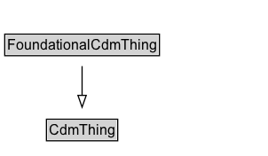

# FoundationalCdmThing

## Diagram

=== "SVG (interactive)"

    <!-- Generated by graphviz version 14.0.2 (20251019.1705)
     -->
    <!-- Pages: 1 -->
    <svg width="226pt" height="132pt"
     viewBox="0.00 0.00 226.00 132.00" xmlns="http://www.w3.org/2000/svg" xmlns:xlink="http://www.w3.org/1999/xlink">
    <g id="graph0" class="graph" transform="scale(1 1) rotate(0) translate(4 128)">
    <polygon fill="white" stroke="none" points="-4,4 -4,-128 222.38,-128 222.38,4 -4,4"/>
    <g id="clust2" class="cluster">
    <title>cluster_associated</title>
    </g>
    <!-- FoundationalCdmThing -->
    <g id="node1" class="node">
    <title>FoundationalCdmThing</title>
    <g id="a_node1"><a xlink:href="../FoundationalCdmThing" xlink:title="&lt;TABLE&gt;">
    <polygon fill="lightgray" stroke="none" points="1,-81.88 1,-98.12 129.75,-98.12 129.75,-81.88 1,-81.88"/>
    <text xml:space="preserve" text-anchor="start" x="2" y="-85.72" font-family="Arial" font-size="12.00">FoundationalCdmThing</text>
    <polygon fill="none" stroke="black" points="0,-80.88 0,-99.12 130.75,-99.12 130.75,-80.88 0,-80.88"/>
    </a>
    </g>
    </g>
    <!-- CdmThing -->
    <g id="node3" class="node">
    <title>CdmThing</title>
    <g id="a_node3"><a xlink:href="../CdmThing" xlink:title="&lt;TABLE&gt;">
    <polygon fill="lightgray" stroke="none" points="36.25,-9.88 36.25,-26.12 94.5,-26.12 94.5,-9.88 36.25,-9.88"/>
    <text xml:space="preserve" text-anchor="start" x="37.25" y="-13.72" font-family="Arial" font-size="12.00">CdmThing</text>
    <polygon fill="none" stroke="black" points="35.25,-8.88 35.25,-27.12 95.5,-27.12 95.5,-8.88 35.25,-8.88"/>
    </a>
    </g>
    </g>
    <!-- FoundationalCdmThing&#45;&gt;CdmThing -->
    <g id="edge1" class="edge">
    <title>FoundationalCdmThing&#45;&gt;CdmThing</title>
    <path fill="none" stroke="black" d="M65.38,-72.05C65.38,-64.57 65.38,-55.58 65.38,-47.14"/>
    <polygon fill="none" stroke="black" points="68.88,-47.3 65.38,-37.3 61.88,-47.3 68.88,-47.3"/>
    </g>
    <!-- Invis -->
    </g>
    </svg>

=== "PNG"

    

## Specializations of FoundationalCdmThing

| Class | Description |
|-------|-------------|
| [acceleration](Acceleration.md) |  |
| [acceleration unit](AccelerationUnit.md) |  |
| [Activity](Activity.md) |  |
| [Activity Status](ActivityStatus.md) |  |
| [Activity Thing](ActivityThing.md) |  |
| [Agent (SpatialLocPattern)](Agent.md) |  |
| [Agent (SpatialLocPattern)](Agent.md) |  |
| [Agent Thing](AgentThing.md) |  |
| [Agreement](Agreement.md) |  |
| [Agreement Thing](AgreementThing.md) |  |
| [amount of money](AmountOfMoney.md) |  |
| [area](Area.md) |  |
| [area unit](AreaUnit.md) |  |
| [Atomic Agreement](AtomicAgreement.md) |  |
| [Capacity](Capacity.md) |  |
| [Capacity Size](CapacitySize.md) |  |
| [Cardinality Measure](CardinalityMeasure.md) |  |
| [Cardinality Unit Per Time](CardinalityUnitPerTime.md) |  |
| [Change Thing](ChangeThing.md) |  |
| [City Units Thing](CityUnitsThing.md) |  |
| [Complex Agreement](ComplexAgreement.md) |  |
| [Conjunctive Agreement](ConjunctiveAgreement.md) |  |
| [Conjunctive State](ConjunctiveState.md) |  |
| [Consume State](ConsumeState.md) |  |
| [Daily Recurring Event](DailyRecurringEvent.md) |  |
| [Disjunctive Agreement](DisjunctiveAgreement.md) |  |
| [Disjunctive State](DisjunctiveState.md) |  |
| [Divisible Resource](DivisibleResource.md) |  |
| [duration](Duration.md) |  |
| [Exception Day](ExceptionDay.md) |  |
| [First Manifestation](FirstManifestation.md) |  |
| [Location](Location.md) |  |
| [Manifestation](Manifestation.md) |  |
| [Manifestation State](ManifestationState.md) |  |
| [Monthly Recurring Event](MonthlyRecurringEvent.md) |  |
| [Non Divisible Resource](NonDivisibleResource.md) |  |
| [Non Terminal State](NonTerminalState.md) |  |
| [Organization](Organization.md) |  |
| [Organization](Organization.md) |  |
| [Organization Thing](OrganizationThing.md) |  |
| [Planned Allocation](PlannedAllocation.md) |  |
| [Planned Allocation](PlannedAllocation.md) |  |
| [Produce State](ProduceState.md) |  |
| [Recurring Event](RecurringEvent.md) |  |
| [Recurring Event Thing](RecurringEventThing.md) |  |
| [Release State](ReleaseState.md) |  |
| [Resource](Resource.md) |  |
| [Resource Thing](ResourceThing.md) |  |
| [Spatial Loc Thing](SpatialLocThing.md) |  |
| [State](State.md) |  |
| [State Status](StateStatus.md) |  |
| [Terminal Resource State](TerminalResourceState.md) |  |
| [Terminal Resource State](TerminalResourceState.md) |  |
| [Terminal State](TerminalState.md) |  |
| [Use State](UseState.md) |  |
| [Value Of Money](ValueOfMoney.md) |  |
| [Weekly Recurring Event](WeeklyRecurringEvent.md) |  |
| [Yearly Recurring Event](YearlyRecurringEvent.md) |  |

## Formalization for FoundationalCdmThing

| Property | Constraint |
|----------|------------|
| subClassOf | [CdmThing](CdmThing.md) |

