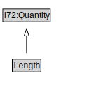

# Length

<a href="diagrams/Length.dot.svg">Open interactive Length diagram</a>

## Formalization for Length

| Property | Constraint |
|----------|------------|
| i72:value | all ComplexExpr and i72:Measure |
| subClassOf | i72:Quantity |

