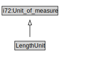

# LengthUnit

<a href="diagrams/LengthUnit.dot.svg">Open interactive LengthUnit diagram</a>

## Formalization for LengthUnit

| Property | Constraint |
|----------|------------|
| subClassOf | i72:Unit_of_measure |

