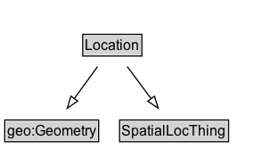

# Location

## Diagram

=== "SVG (interactive)"

    <!-- Generated by graphviz version 14.0.2 (20251019.1705)
     -->
    <!-- Pages: 1 -->
    <svg width="214pt" height="132pt"
     viewBox="0.00 0.00 214.00 132.00" xmlns="http://www.w3.org/2000/svg" xmlns:xlink="http://www.w3.org/1999/xlink">
    <g id="graph0" class="graph" transform="scale(1 1) rotate(0) translate(4 128)">
    <polygon fill="white" stroke="none" points="-4,4 -4,-128 209.5,-128 209.5,4 -4,4"/>
    <g id="clust2" class="cluster">
    <title>cluster_associated</title>
    </g>
    <!-- Location -->
    <g id="node1" class="node">
    <title>Location</title>
    <g id="a_node1"><a xlink:href="../Location" xlink:title="&lt;TABLE&gt;">
    <polygon fill="lightgray" stroke="none" points="66.62,-81.88 66.62,-98.12 114.38,-98.12 114.38,-81.88 66.62,-81.88"/>
    <text xml:space="preserve" text-anchor="start" x="67.62" y="-85.72" font-family="Arial" font-size="12.00">Location</text>
    <polygon fill="none" stroke="black" points="65.62,-80.88 65.62,-99.12 115.38,-99.12 115.38,-80.88 65.62,-80.88"/>
    </a>
    </g>
    </g>
    <!-- geo_Geometry -->
    <g id="node3" class="node">
    <title>geo_Geometry</title>
    <g id="a_node3"><a xlink:href="https://w3id.org/citydata/imported/geo/latest/Geometry" xlink:title="&lt;TABLE&gt;">
    <polygon fill="lightgray" stroke="none" points="1,-9.88 1,-26.12 78,-26.12 78,-9.88 1,-9.88"/>
    <text xml:space="preserve" text-anchor="start" x="2" y="-13.72" font-family="Arial" font-size="12.00">geo:Geometry</text>
    <polygon fill="none" stroke="black" points="0,-8.88 0,-27.12 79,-27.12 79,-8.88 0,-8.88"/>
    </a>
    </g>
    </g>
    <!-- Location&#45;&gt;geo_Geometry -->
    <g id="edge1" class="edge">
    <title>Location&#45;&gt;geo_Geometry</title>
    <path fill="none" stroke="black" d="M78.15,-72.05C72.2,-63.89 64.94,-53.91 58.31,-44.82"/>
    <polygon fill="none" stroke="black" points="61.34,-43.03 52.62,-37.01 55.68,-47.16 61.34,-43.03"/>
    </g>
    <!-- SpatialLocThing -->
    <g id="node4" class="node">
    <title>SpatialLocThing</title>
    <g id="a_node4"><a xlink:href="../SpatialLocThing" xlink:title="&lt;TABLE&gt;">
    <polygon fill="lightgray" stroke="none" points="97.62,-9.88 97.62,-26.12 187.38,-26.12 187.38,-9.88 97.62,-9.88"/>
    <text xml:space="preserve" text-anchor="start" x="98.62" y="-13.72" font-family="Arial" font-size="12.00">SpatialLocThing</text>
    <polygon fill="none" stroke="black" points="96.62,-8.88 96.62,-27.12 188.38,-27.12 188.38,-8.88 96.62,-8.88"/>
    </a>
    </g>
    </g>
    <!-- Location&#45;&gt;SpatialLocThing -->
    <g id="edge2" class="edge">
    <title>Location&#45;&gt;SpatialLocThing</title>
    <path fill="none" stroke="black" d="M103.09,-72.05C109.16,-63.89 116.57,-53.91 123.32,-44.82"/>
    <polygon fill="none" stroke="black" points="125.97,-47.12 129.13,-37 120.35,-42.94 125.97,-47.12"/>
    </g>
    <!-- Invis -->
    </g>
    </svg>

=== "PNG"

    

## Formalization for Location

| Property | Constraint |
|----------|------------|
| subClassOf | [geo:Geometry](https://w3id.org/citydata/imported/geo/Geometry) |
| subClassOf | [SpatialLocThing](SpatialLocThing.md) |

## Used by classes

| Class | Property |
|-------|----------|
| [Activity](Activity.md) | [associatedLocation](https://w3id.org/citydata/part1/v1/associatedLocation) |
| [Agreement](Agreement.md) | [validIn](https://w3id.org/citydata/part1/v1/validIn) |
| [Recurring Event](RecurringEvent.md) | [associatedLocation](https://w3id.org/citydata/part1/v1/associatedLocation) |
| [Resource](Resource.md) | [hasLocation](https://w3id.org/citydata/part1/v1/hasLocation) |

