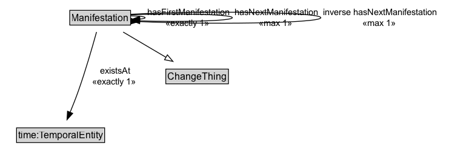

# Manifestation

## Diagram

=== "SVG (interactive)"

    <!-- Generated by graphviz version 14.0.2 (20251019.1705)
     -->
    <!-- Pages: 1 -->
    <svg width="584pt" height="206pt"
     viewBox="0.00 0.00 584.00 206.00" xmlns="http://www.w3.org/2000/svg" xmlns:xlink="http://www.w3.org/1999/xlink">
    <g id="graph0" class="graph" transform="scale(1 1) rotate(0) translate(4 202)">
    <polygon fill="white" stroke="none" points="-4,4 -4,-202 580.12,-202 580.12,4 -4,4"/>
    <g id="clust2" class="cluster">
    <title>cluster_associated</title>
    </g>
    <!-- Manifestation -->
    <g id="node1" class="node">
    <title>Manifestation</title>
    <g id="a_node1"><a xlink:href="../Manifestation" xlink:title="&lt;TABLE&gt;">
    <polygon fill="lightgray" stroke="none" points="83.38,-171.88 83.38,-188.12 156.62,-188.12 156.62,-171.88 83.38,-171.88"/>
    <text xml:space="preserve" text-anchor="start" x="84.38" y="-175.72" font-family="Arial" font-size="12.00">Manifestation</text>
    <polygon fill="none" stroke="black" points="82.38,-170.88 82.38,-189.12 157.62,-189.12 157.62,-170.88 82.38,-170.88"/>
    </a>
    </g>
    </g>
    <!-- Manifestation&#45;&gt;Manifestation -->
    <g id="edge5" class="edge">
    <title>Manifestation&#45;&gt;Manifestation</title>
    <path fill="none" stroke="black" d="M157.44,-182.27C167.75,-182.16 175.62,-181.4 175.62,-180 175.62,-179.19 172.99,-178.59 168.78,-178.22"/>
    <polygon fill="black" stroke="black" points="169.09,-174.73 158.95,-177.8 168.79,-181.72 169.09,-174.73"/>
    <text xml:space="preserve" text-anchor="middle" x="229.62" y="-183.05" font-family="Arial" font-size="11.00"> hasFirstManifestation </text>
    <text xml:space="preserve" text-anchor="middle" x="229.62" y="-169.55" font-family="Arial" font-size="11.00"> «exactly 1» &#160;</text>
    </g>
    <!-- Manifestation&#45;&gt;Manifestation -->
    <g id="edge6" class="edge">
    <title>Manifestation&#45;&gt;Manifestation</title>
    <path fill="none" stroke="black" d="M157.48,-183.49C207.01,-185.68 283.62,-184.51 283.62,-180 283.62,-175.82 217.96,-174.51 168.91,-176.08"/>
    <polygon fill="black" stroke="black" points="168.85,-172.58 158.99,-176.45 169.11,-179.57 168.85,-172.58"/>
    <text xml:space="preserve" text-anchor="middle" x="338.38" y="-183.05" font-family="Arial" font-size="11.00"> hasNextManifestation </text>
    <text xml:space="preserve" text-anchor="middle" x="338.38" y="-169.55" font-family="Arial" font-size="11.00"> «max 1» &#160;</text>
    </g>
    <!-- Manifestation&#45;&gt;Manifestation -->
    <g id="edge7" class="edge">
    <title>Manifestation&#45;&gt;Manifestation</title>
    <path fill="none" stroke="black" d="M157.38,-184.22C234.13,-188.79 393.12,-187.39 393.12,-180 393.12,-172.93 247.5,-171.34 167.71,-175.22"/>
    <polygon fill="black" stroke="black" points="157.69,-172.26 167.86,-175.21 158.06,-179.25 157.69,-172.26"/>
    <text xml:space="preserve" text-anchor="middle" x="466.62" y="-183.05" font-family="Arial" font-size="11.00"> inverse hasNextManifestation </text>
    <text xml:space="preserve" text-anchor="middle" x="466.62" y="-169.55" font-family="Arial" font-size="11.00"> «max 1» &#160;</text>
    </g>
    <!-- Invis -->
    <!-- Manifestation&#45;&gt;Invis -->
    <!-- time_TemporalEntity -->
    <g id="node3" class="node">
    <title>time_TemporalEntity</title>
    <g id="a_node3"><a xlink:href="https://w3id.org/citydata/imported/time/latest/TemporalEntity" xlink:title="&lt;TABLE&gt;">
    <polygon fill="lightgray" stroke="none" points="17.5,-25.88 17.5,-42.12 124.5,-42.12 124.5,-25.88 17.5,-25.88"/>
    <text xml:space="preserve" text-anchor="start" x="18.5" y="-29.73" font-family="Arial" font-size="12.00">time:TemporalEntity</text>
    <polygon fill="none" stroke="black" points="16.5,-24.88 16.5,-43.12 125.5,-43.12 125.5,-24.88 16.5,-24.88"/>
    </a>
    </g>
    </g>
    <!-- Manifestation&#45;&gt;time_TemporalEntity -->
    <g id="edge4" class="edge">
    <title>Manifestation&#45;&gt;time_TemporalEntity</title>
    <path fill="none" stroke="black" d="M115.49,-162.26C110.48,-144.07 101.9,-114.23 93,-89 89.91,-80.24 86.21,-70.82 82.73,-62.34"/>
    <polygon fill="black" stroke="black" points="86.02,-61.14 78.94,-53.26 79.56,-63.84 86.02,-61.14"/>
    <text xml:space="preserve" text-anchor="middle" x="138.47" y="-110.05" font-family="Arial" font-size="11.00"> existsAt </text>
    <text xml:space="preserve" text-anchor="middle" x="138.47" y="-96.55" font-family="Arial" font-size="11.00"> «exactly 1» &#160;</text>
    </g>
    <!-- ChangeThing -->
    <g id="node4" class="node">
    <title>ChangeThing</title>
    <g id="a_node4"><a xlink:href="../ChangeThing" xlink:title="&lt;TABLE&gt;">
    <polygon fill="lightgray" stroke="none" points="202.25,-98.88 202.25,-115.12 277.75,-115.12 277.75,-98.88 202.25,-98.88"/>
    <text xml:space="preserve" text-anchor="start" x="203.25" y="-102.72" font-family="Arial" font-size="12.00">ChangeThing</text>
    <polygon fill="none" stroke="black" points="201.25,-97.88 201.25,-116.12 278.75,-116.12 278.75,-97.88 201.25,-97.88"/>
    </a>
    </g>
    </g>
    <!-- Manifestation&#45;&gt;ChangeThing -->
    <g id="edge1" class="edge">
    <title>Manifestation&#45;&gt;ChangeThing</title>
    <path fill="none" stroke="black" d="M148.44,-162.17C164.31,-152.78 184.31,-140.95 201.56,-130.74"/>
    <polygon fill="none" stroke="black" points="203.22,-133.83 210.05,-125.72 199.66,-127.8 203.22,-133.83"/>
    </g>
    <!-- Invis&#45;&gt;time_TemporalEntity -->
    </g>
    </svg>

=== "PNG"

    

## Specializations of Manifestation

| Class | Description |
|-------|-------------|
| [First Manifestation](FirstManifestation.md) |  |
| [Planned Allocation](PlannedAllocation.md) |  |

## Formalization for Manifestation

| Property | Constraint |
|----------|------------|
| [existsAt](https://w3id.org/citydata/part1/v1/existsAt) | exactly 1 |
| [hasFirstManifestation](https://w3id.org/citydata/part1/v1/hasFirstManifestation) | exactly 1 |
| [hasNextManifestation](https://w3id.org/citydata/part1/v1/hasNextManifestation) | max 1 |
| [hasPreviousManifestation](https://w3id.org/citydata/part1/v1/hasPreviousManifestation) | max 1 |
| subClassOf | [ChangeThing](ChangeThing.md) |

## Used by classes

| Class | Property |
|-------|----------|
| [Manifestation State](ManifestationState.md) | [satisfiedBy](https://w3id.org/citydata/part1/v1/satisfiedBy) |

