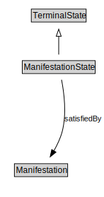

# ManifestationState

<a href="diagrams/ManifestationState.dot.svg">Open interactive ManifestationState diagram</a>

## Formalization for ManifestationState

| Property | Constraint |
|----------|------------|
| satisfiedBy | all Manifestation |
| subClassOf | TerminalState |

