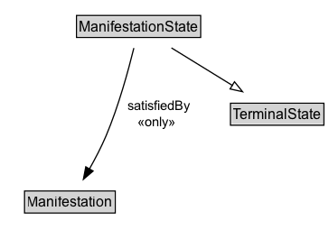

# ManifestationState

## Diagram

=== "SVG (interactive)"

    <!-- Generated by graphviz version 14.0.2 (20251019.1705)
     -->
    <!-- Pages: 1 -->
    <svg width="273pt" height="206pt"
     viewBox="0.00 0.00 273.00 206.00" xmlns="http://www.w3.org/2000/svg" xmlns:xlink="http://www.w3.org/1999/xlink">
    <g id="graph0" class="graph" transform="scale(1 1) rotate(0) translate(4 202)">
    <polygon fill="white" stroke="none" points="-4,4 -4,-202 268.75,-202 268.75,4 -4,4"/>
    <g id="clust2" class="cluster">
    <title>cluster_associated</title>
    </g>
    <!-- ManifestationState -->
    <g id="node1" class="node">
    <title>ManifestationState</title>
    <g id="a_node1"><a xlink:href="../ManifestationState" xlink:title="&lt;TABLE&gt;">
    <polygon fill="lightgray" stroke="none" points="60.5,-171.88 60.5,-188.12 161.5,-188.12 161.5,-171.88 60.5,-171.88"/>
    <text xml:space="preserve" text-anchor="start" x="61.5" y="-175.72" font-family="Arial" font-size="12.00">ManifestationState</text>
    <polygon fill="none" stroke="black" points="59.5,-170.88 59.5,-189.12 162.5,-189.12 162.5,-170.88 59.5,-170.88"/>
    </a>
    </g>
    </g>
    <!-- Invis -->
    <!-- ManifestationState&#45;&gt;Invis -->
    <!-- Manifestation -->
    <g id="node3" class="node">
    <title>Manifestation</title>
    <g id="a_node3"><a xlink:href="../Manifestation" xlink:title="&lt;TABLE&gt;">
    <polygon fill="lightgray" stroke="none" points="17.38,-25.88 17.38,-42.12 90.62,-42.12 90.62,-25.88 17.38,-25.88"/>
    <text xml:space="preserve" text-anchor="start" x="18.38" y="-29.73" font-family="Arial" font-size="12.00">Manifestation</text>
    <polygon fill="none" stroke="black" points="16.38,-24.88 16.38,-43.12 91.62,-43.12 91.62,-24.88 16.38,-24.88"/>
    </a>
    </g>
    </g>
    <!-- ManifestationState&#45;&gt;Manifestation -->
    <g id="edge4" class="edge">
    <title>ManifestationState&#45;&gt;Manifestation</title>
    <path fill="none" stroke="black" d="M107.07,-162.03C102.56,-143.65 94.4,-113.65 84,-89 80.09,-79.73 75.01,-70 70.15,-61.39"/>
    <polygon fill="black" stroke="black" points="73.24,-59.74 65.19,-52.86 67.19,-63.26 73.24,-59.74"/>
    <text xml:space="preserve" text-anchor="middle" x="127.88" y="-110.05" font-family="Arial" font-size="11.00"> satisfiedBy </text>
    <text xml:space="preserve" text-anchor="middle" x="127.88" y="-96.55" font-family="Arial" font-size="11.00"> «only» &#160;</text>
    </g>
    <!-- TerminalState -->
    <g id="node4" class="node">
    <title>TerminalState</title>
    <g id="a_node4"><a xlink:href="../TerminalState" xlink:title="&lt;TABLE&gt;">
    <polygon fill="lightgray" stroke="none" points="188.25,-98.88 188.25,-115.12 263.75,-115.12 263.75,-98.88 188.25,-98.88"/>
    <text xml:space="preserve" text-anchor="start" x="189.25" y="-102.72" font-family="Arial" font-size="12.00">TerminalState</text>
    <polygon fill="none" stroke="black" points="187.25,-97.88 187.25,-116.12 264.75,-116.12 264.75,-97.88 187.25,-97.88"/>
    </a>
    </g>
    </g>
    <!-- ManifestationState&#45;&gt;TerminalState -->
    <g id="edge1" class="edge">
    <title>ManifestationState&#45;&gt;TerminalState</title>
    <path fill="none" stroke="black" d="M138.25,-162.17C153.47,-152.78 172.63,-140.95 189.16,-130.74"/>
    <polygon fill="none" stroke="black" points="190.59,-133.98 197.26,-125.75 186.91,-128.02 190.59,-133.98"/>
    </g>
    <!-- Invis&#45;&gt;Manifestation -->
    </g>
    </svg>

=== "PNG"

    

## Formalization for ManifestationState

| Property | Constraint |
|----------|------------|
| [satisfiedBy](https://w3id.org/citydata/part1/v1/satisfiedBy) | only [Manifestation](Manifestation.md) |
| subClassOf | [TerminalState](TerminalState.md) |

