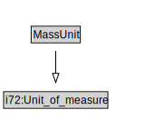

# MassUnit

<a href="diagrams/MassUnit.dot.svg">Open interactive MassUnit diagram</a>

## Formalization for MassUnit

| Property | Constraint |
|----------|------------|
| subClassOf | i72:Unit_of_measure |

