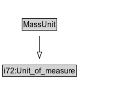

# MassUnit

## Diagram

=== "SVG (interactive)"

    <!-- Generated by graphviz version 14.0.2 (20251019.1705)
     -->
    <!-- Pages: 1 -->
    <svg width="181pt" height="132pt"
     viewBox="0.00 0.00 181.00 132.00" xmlns="http://www.w3.org/2000/svg" xmlns:xlink="http://www.w3.org/1999/xlink">
    <g id="graph0" class="graph" transform="scale(1 1) rotate(0) translate(4 128)">
    <polygon fill="white" stroke="none" points="-4,4 -4,-128 176.5,-128 176.5,4 -4,4"/>
    <g id="clust2" class="cluster">
    <title>cluster_associated</title>
    </g>
    <!-- MassUnit -->
    <g id="node1" class="node">
    <title>MassUnit</title>
    <g id="a_node1"><a xlink:href="../MassUnit" xlink:title="&lt;TABLE&gt;">
    <polygon fill="lightgray" stroke="none" points="31.38,-81.88 31.38,-98.12 83.62,-98.12 83.62,-81.88 31.38,-81.88"/>
    <text xml:space="preserve" text-anchor="start" x="32.38" y="-85.72" font-family="Arial" font-size="12.00">MassUnit</text>
    <polygon fill="none" stroke="black" points="30.38,-80.88 30.38,-99.12 84.62,-99.12 84.62,-80.88 30.38,-80.88"/>
    </a>
    </g>
    </g>
    <!-- i72_Unit_of_measure -->
    <g id="node3" class="node">
    <title>i72_Unit_of_measure</title>
    <g id="a_node3"><a xlink:href="https://w3id.org/citydata/21972/v1/Unit_of_measure" xlink:title="&lt;TABLE&gt;">
    <polygon fill="lightgray" stroke="none" points="1,-9.88 1,-26.12 114,-26.12 114,-9.88 1,-9.88"/>
    <text xml:space="preserve" text-anchor="start" x="2" y="-13.72" font-family="Arial" font-size="12.00">i72:Unit_of_measure</text>
    <polygon fill="none" stroke="black" points="0,-8.88 0,-27.12 115,-27.12 115,-8.88 0,-8.88"/>
    </a>
    </g>
    </g>
    <!-- MassUnit&#45;&gt;i72_Unit_of_measure -->
    <g id="edge1" class="edge">
    <title>MassUnit&#45;&gt;i72_Unit_of_measure</title>
    <path fill="none" stroke="black" d="M57.5,-72.05C57.5,-64.57 57.5,-55.58 57.5,-47.14"/>
    <polygon fill="none" stroke="black" points="61,-47.3 57.5,-37.3 54,-47.3 61,-47.3"/>
    </g>
    <!-- Invis -->
    </g>
    </svg>

=== "PNG"

    

## Formalization for MassUnit

| Property | Constraint |
|----------|------------|
| subClassOf | [i72:Unit_of_measure](https://w3id.org/citydata/21972/v1/Unit_of_measure) |

