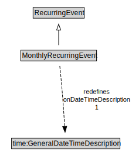

# MonthlyRecurringEvent

<a href="diagrams/MonthlyRecurringEvent.dot.svg">Open interactive MonthlyRecurringEvent diagram</a>

## Formalization for MonthlyRecurringEvent

| Property | Constraint |
|----------|------------|
| onDateTimeDescription | exactly 1 owl:Thing |
| subClassOf | RecurringEvent |

