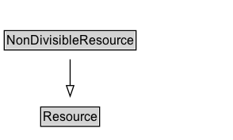

# NonDivisibleResource

## Diagram

=== "SVG (interactive)"

    <!-- Generated by graphviz version 14.0.2 (20251019.1705)
     -->
    <!-- Pages: 1 -->
    <svg width="220pt" height="132pt"
     viewBox="0.00 0.00 220.00 132.00" xmlns="http://www.w3.org/2000/svg" xmlns:xlink="http://www.w3.org/1999/xlink">
    <g id="graph0" class="graph" transform="scale(1 1) rotate(0) translate(4 128)">
    <polygon fill="white" stroke="none" points="-4,4 -4,-128 216.38,-128 216.38,4 -4,4"/>
    <g id="clust2" class="cluster">
    <title>cluster_associated</title>
    </g>
    <!-- NonDivisibleResource -->
    <g id="node1" class="node">
    <title>NonDivisibleResource</title>
    <g id="a_node1"><a xlink:href="../NonDivisibleResource" xlink:title="&lt;TABLE&gt;">
    <polygon fill="lightgray" stroke="none" points="1,-81.88 1,-98.12 123.75,-98.12 123.75,-81.88 1,-81.88"/>
    <text xml:space="preserve" text-anchor="start" x="2" y="-85.72" font-family="Arial" font-size="12.00">NonDivisibleResource</text>
    <polygon fill="none" stroke="black" points="0,-80.88 0,-99.12 124.75,-99.12 124.75,-80.88 0,-80.88"/>
    </a>
    </g>
    </g>
    <!-- Resource -->
    <g id="node3" class="node">
    <title>Resource</title>
    <g id="a_node3"><a xlink:href="../Resource" xlink:title="&lt;TABLE&gt;">
    <polygon fill="lightgray" stroke="none" points="35.5,-9.88 35.5,-26.12 89.25,-26.12 89.25,-9.88 35.5,-9.88"/>
    <text xml:space="preserve" text-anchor="start" x="36.5" y="-13.72" font-family="Arial" font-size="12.00">Resource</text>
    <polygon fill="none" stroke="black" points="34.5,-8.88 34.5,-27.12 90.25,-27.12 90.25,-8.88 34.5,-8.88"/>
    </a>
    </g>
    </g>
    <!-- NonDivisibleResource&#45;&gt;Resource -->
    <g id="edge1" class="edge">
    <title>NonDivisibleResource&#45;&gt;Resource</title>
    <path fill="none" stroke="black" d="M62.38,-72.05C62.38,-64.57 62.38,-55.58 62.38,-47.14"/>
    <polygon fill="none" stroke="black" points="65.88,-47.3 62.38,-37.3 58.88,-47.3 65.88,-47.3"/>
    </g>
    <!-- Invis -->
    </g>
    </svg>

=== "PNG"

    

## Formalization for NonDivisibleResource

| Property | Constraint |
|----------|------------|
| subClassOf | [Resource](Resource.md) |

