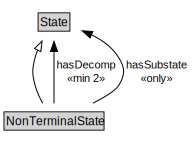

# NonTerminalState

<a href="diagrams/NonTerminalState.dot.svg">Open interactive NonTerminalState diagram</a>

## Specializations of NonTerminalState

| Class | Description |
|-------|-------------|
| [Conjunctive State](ConjunctiveState.md) |  |
| [Disjunctive State](DisjunctiveState.md) |  |

## Formalization for NonTerminalState

| Property | Constraint |
|----------|------------|
| disjointWith | TerminalState |
| hasDecomp | min 2 owl:Thing |
| hasSubstate | all State |
| subClassOf | State |

