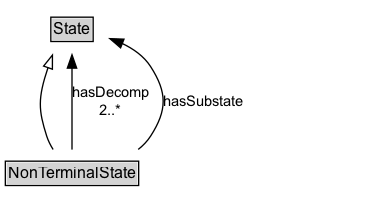

# NonTerminalState

## Diagram

=== "SVG (interactive)"

    <!-- Generated by graphviz version 14.0.2 (20251019.1705)
     -->
    <!-- Pages: 1 -->
    <svg width="196pt" height="159pt"
     viewBox="0.00 0.00 196.00 159.00" xmlns="http://www.w3.org/2000/svg" xmlns:xlink="http://www.w3.org/1999/xlink">
    <g id="graph0" class="graph" transform="scale(1 1) rotate(0) translate(4 155)">
    <polygon fill="white" stroke="none" points="-4,4 -4,-155 192,-155 192,4 -4,4"/>
    <g id="clust2" class="cluster">
    <title>cluster_associated</title>
    </g>
    <!-- NonTerminalState -->
    <g id="node1" class="node">
    <title>NonTerminalState</title>
    <g id="a_node1"><a xlink:href="../NonTerminalState" xlink:title="&lt;TABLE&gt;">
    <polygon fill="lightgray" stroke="none" points="1,-108.88 1,-125.12 99,-125.12 99,-108.88 1,-108.88"/>
    <text xml:space="preserve" text-anchor="start" x="2" y="-112.72" font-family="Arial" font-size="12.00">NonTerminalState</text>
    <polygon fill="none" stroke="black" points="0,-107.88 0,-126.12 100,-126.12 100,-107.88 0,-107.88"/>
    </a>
    </g>
    </g>
    <!-- State -->
    <g id="node3" class="node">
    <title>State</title>
    <g id="a_node3"><a xlink:href="../State" xlink:title="&lt;TABLE&gt;">
    <polygon fill="lightgray" stroke="none" points="35.12,-9.88 35.12,-26.12 64.88,-26.12 64.88,-9.88 35.12,-9.88"/>
    <text xml:space="preserve" text-anchor="start" x="36.12" y="-13.72" font-family="Arial" font-size="12.00">State</text>
    <polygon fill="none" stroke="black" points="34.12,-8.88 34.12,-27.12 65.88,-27.12 65.88,-8.88 34.12,-8.88"/>
    </a>
    </g>
    </g>
    <!-- NonTerminalState&#45;&gt;State -->
    <g id="edge1" class="edge">
    <title>NonTerminalState&#45;&gt;State</title>
    <path fill="none" stroke="black" d="M38.73,-99.26C35.59,-93.69 32.6,-87.3 31,-81 28.05,-69.37 28.05,-65.63 31,-54 31.67,-51.34 32.6,-48.67 33.67,-46.05"/>
    <polygon fill="none" stroke="black" points="36.8,-47.62 38.06,-37.1 30.51,-44.54 36.8,-47.62"/>
    </g>
    <!-- NonTerminalState&#45;&gt;State -->
    <g id="edge2" class="edge">
    <title>NonTerminalState&#45;&gt;State</title>
    <path fill="none" stroke="black" d="M50,-99.1C50,-84.78 50,-63.93 50,-47.1"/>
    <polygon fill="black" stroke="black" points="53.5,-47.22 50,-37.22 46.5,-47.22 53.5,-47.22"/>
    <text xml:space="preserve" text-anchor="middle" x="81.88" y="-70.55" font-family="Arial" font-size="11.00"> hasDecomp </text>
    <text xml:space="preserve" text-anchor="middle" x="81.88" y="-57.05" font-family="Arial" font-size="11.00"> «min 2» &#160;</text>
    </g>
    <!-- NonTerminalState&#45;&gt;State -->
    <g id="edge3" class="edge">
    <title>NonTerminalState&#45;&gt;State</title>
    <path fill="none" stroke="black" d="M88.98,-99.16C100.86,-93.18 111.68,-86.56 115,-81 121.15,-70.7 121.15,-64.3 115,-54 108.72,-43.49 98.09,-35.96 87.22,-30.63"/>
    <polygon fill="black" stroke="black" points="88.82,-27.51 78.25,-26.78 86.05,-33.94 88.82,-27.51"/>
    <text xml:space="preserve" text-anchor="middle" x="152.62" y="-70.55" font-family="Arial" font-size="11.00"> hasSubstate </text>
    <text xml:space="preserve" text-anchor="middle" x="152.62" y="-57.05" font-family="Arial" font-size="11.00"> «only» &#160;</text>
    </g>
    <!-- Invis -->
    </g>
    </svg>

=== "PNG"

    

## Specializations of NonTerminalState

| Class | Description |
|-------|-------------|
| [Conjunctive State](ConjunctiveState.md) |  |
| [Disjunctive State](DisjunctiveState.md) |  |

## Formalization for NonTerminalState

| Property | Constraint |
|----------|------------|
| [hasDecomp](https://w3id.org/citydata/part1/v1/hasDecomp) | min 2 |
| [hasSubstate](https://w3id.org/citydata/part1/v1/hasSubstate) | only [State](State.md) |
| disjointWith | [TerminalState](TerminalState.md) |
| subClassOf | [State](State.md) |

