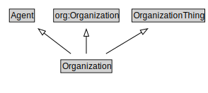

# Organization

<a href="diagrams/Organization.dot.svg">Open interactive Organization diagram</a>

## Formalization for Organization

| Property | Constraint |
|----------|------------|
| subClassOf | Agent |
| subClassOf | OrganizationThing |
| subClassOf | org:Organization |

