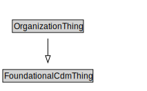

# OrganizationThing

<a href="diagrams/OrganizationThing.dot.svg">Open interactive OrganizationThing diagram</a>

## Specializations of OrganizationThing

| Class | Description |
|-------|-------------|
| [Organization](Organization.md) |  |

## Formalization for OrganizationThing

| Property | Constraint |
|----------|------------|
| subClassOf | FoundationalCdmThing |

