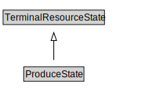

# ProduceState

<a href="diagrams/ProduceState.dot.svg">Open interactive ProduceState diagram</a>

## Formalization for ProduceState

| Property | Constraint |
|----------|------------|
| subClassOf | TerminalResourceState |

