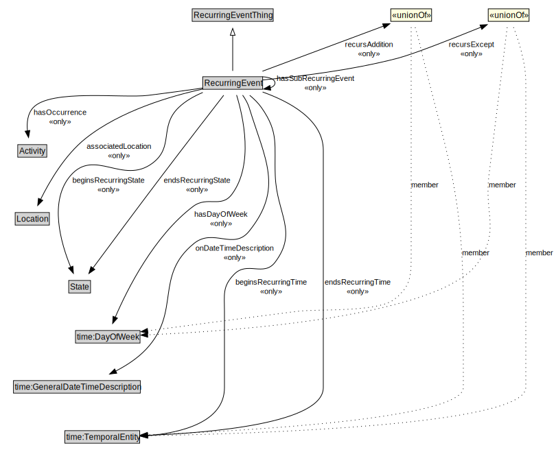

# RecurringEvent

<a href="diagrams/RecurringEvent.dot.svg">Open interactive RecurringEvent diagram</a>

## Specializations of RecurringEvent

| Class | Description |
|-------|-------------|
| [Daily Recurring Event](DailyRecurringEvent.md) |  |
| [Monthly Recurring Event](MonthlyRecurringEvent.md) |  |
| [Weekly Recurring Event](WeeklyRecurringEvent.md) |  |
| [Yearly Recurring Event](YearlyRecurringEvent.md) |  |

## Formalization for RecurringEvent

| Property | Constraint |
|----------|------------|
| associatedLocation | all Location |
| beginsRecurringState | all State |
| beginsRecurringTime | all time:TemporalEntity |
| endsRecurringState | all State |
| endsRecurringTime | all time:TemporalEntity |
| endTime | all xsd:time |
| hasDayOfWeek | all time:DayOfWeek |
| hasOccurrence | all Activity |
| hasSubRecurringEvent | all RecurringEvent |
| onDateTimeDescription | all time:GeneralDateTimeDescription |
| recursAddition | all time:DayOfWeek or time:TemporalEntity |
| recursExcept | all time:DayOfWeek or time:TemporalEntity |
| startTime | all xsd:time |
| subClassOf | RecurringEventThing |

## Used by classes

| Class | Property |
|-------|----------|
| [Recurring Event](RecurringEvent.md) | hasSubRecurringEvent |

