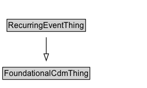

# RecurringEventThing

## Diagram

=== "SVG (interactive)"

    <!-- Generated by graphviz version 14.0.2 (20251019.1705)
     -->
    <!-- Pages: 1 -->
    <svg width="220pt" height="132pt"
     viewBox="0.00 0.00 220.00 132.00" xmlns="http://www.w3.org/2000/svg" xmlns:xlink="http://www.w3.org/1999/xlink">
    <g id="graph0" class="graph" transform="scale(1 1) rotate(0) translate(4 128)">
    <polygon fill="white" stroke="none" points="-4,4 -4,-128 216.38,-128 216.38,4 -4,4"/>
    <g id="clust2" class="cluster">
    <title>cluster_associated</title>
    </g>
    <!-- RecurringEventThing -->
    <g id="node1" class="node">
    <title>RecurringEventThing</title>
    <g id="a_node1"><a xlink:href="../RecurringEventThing" xlink:title="&lt;TABLE&gt;">
    <polygon fill="lightgray" stroke="none" points="7.38,-81.88 7.38,-98.12 123.38,-98.12 123.38,-81.88 7.38,-81.88"/>
    <text xml:space="preserve" text-anchor="start" x="8.38" y="-85.72" font-family="Arial" font-size="12.00">RecurringEventThing</text>
    <polygon fill="none" stroke="black" points="6.38,-80.88 6.38,-99.12 124.38,-99.12 124.38,-80.88 6.38,-80.88"/>
    </a>
    </g>
    </g>
    <!-- FoundationalCdmThing -->
    <g id="node3" class="node">
    <title>FoundationalCdmThing</title>
    <g id="a_node3"><a xlink:href="../FoundationalCdmThing" xlink:title="&lt;TABLE&gt;">
    <polygon fill="lightgray" stroke="none" points="1,-9.88 1,-26.12 129.75,-26.12 129.75,-9.88 1,-9.88"/>
    <text xml:space="preserve" text-anchor="start" x="2" y="-13.72" font-family="Arial" font-size="12.00">FoundationalCdmThing</text>
    <polygon fill="none" stroke="black" points="0,-8.88 0,-27.12 130.75,-27.12 130.75,-8.88 0,-8.88"/>
    </a>
    </g>
    </g>
    <!-- RecurringEventThing&#45;&gt;FoundationalCdmThing -->
    <g id="edge1" class="edge">
    <title>RecurringEventThing&#45;&gt;FoundationalCdmThing</title>
    <path fill="none" stroke="black" d="M65.38,-72.05C65.38,-64.57 65.38,-55.58 65.38,-47.14"/>
    <polygon fill="none" stroke="black" points="68.88,-47.3 65.38,-37.3 61.88,-47.3 68.88,-47.3"/>
    </g>
    <!-- Invis -->
    </g>
    </svg>

=== "PNG"

    

## Specializations of RecurringEventThing

| Class | Description |
|-------|-------------|
| [Daily Recurring Event](DailyRecurringEvent.md) |  |
| [Exception Day](ExceptionDay.md) |  |
| [Monthly Recurring Event](MonthlyRecurringEvent.md) |  |
| [Recurring Event](RecurringEvent.md) |  |
| [Weekly Recurring Event](WeeklyRecurringEvent.md) |  |
| [Yearly Recurring Event](YearlyRecurringEvent.md) |  |

## Formalization for RecurringEventThing

| Property | Constraint |
|----------|------------|
| subClassOf | [FoundationalCdmThing](FoundationalCdmThing.md) |

