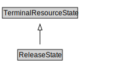

# ReleaseState

<a href="diagrams/ReleaseState.dot.svg">Open interactive ReleaseState diagram</a>

## Formalization for ReleaseState

| Property | Constraint |
|----------|------------|
| subClassOf | TerminalResourceState |

