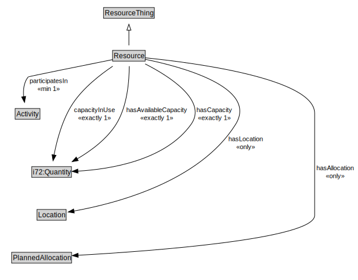

# Resource

<a href="diagrams/Resource.dot.svg">Open interactive Resource diagram</a>

## Specializations of Resource

| Class | Description |
|-------|-------------|
| [Divisible Resource](DivisibleResource.md) |  |
| [Non Divisible Resource](NonDivisibleResource.md) |  |

## Formalization for Resource

| Property | Constraint |
|----------|------------|
| capacityInUse | exactly 1 owl:Thing |
| hasAllocation | all PlannedAllocation |
| hasAvailableCapacity | exactly 1 owl:Thing |
| hasCapacity | exactly 1 owl:Thing |
| hasLocation | all Location |
| participatesIn | min 1 owl:Thing |
| subClassOf | ResourceThing |

## Used by classes

| Class | Property |
|-------|----------|
| [Terminal Resource State](TerminalResourceState.md) | hasResource |

