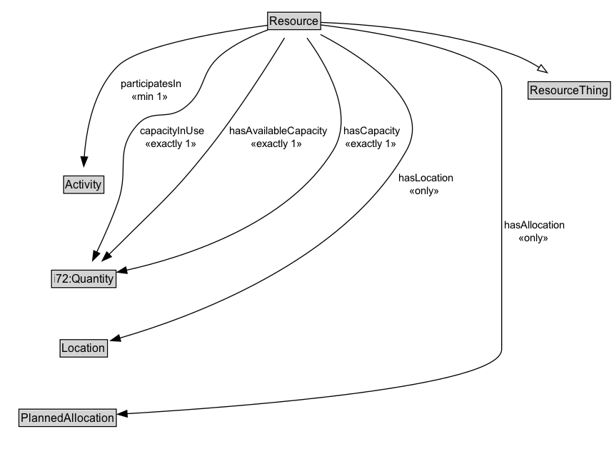

# Resource

## Diagram

=== "SVG (interactive)"

    <!-- Generated by graphviz version 14.0.2 (20251019.1705)
     -->
    <!-- Pages: 1 -->
    <svg width="645pt" height="477pt"
     viewBox="0.00 0.00 645.00 477.00" xmlns="http://www.w3.org/2000/svg" xmlns:xlink="http://www.w3.org/1999/xlink">
    <g id="graph0" class="graph" transform="scale(1 1) rotate(0) translate(4 473)">
    <polygon fill="white" stroke="none" points="-4,4 -4,-473 641.25,-473 641.25,4 -4,4"/>
    <g id="clust2" class="cluster">
    <title>cluster_associated</title>
    </g>
    <!-- Resource -->
    <g id="node1" class="node">
    <title>Resource</title>
    <g id="a_node1"><a xlink:href="../Resource" xlink:title="&lt;TABLE&gt;">
    <polygon fill="lightgray" stroke="none" points="278.12,-442.88 278.12,-459.12 331.88,-459.12 331.88,-442.88 278.12,-442.88"/>
    <text xml:space="preserve" text-anchor="start" x="279.12" y="-446.73" font-family="Arial" font-size="12.00">Resource</text>
    <polygon fill="none" stroke="black" points="277.12,-441.88 277.12,-460.12 332.88,-460.12 332.88,-441.88 277.12,-441.88"/>
    </a>
    </g>
    </g>
    <!-- Invis -->
    <!-- Resource&#45;&gt;Invis -->
    <!-- Activity -->
    <g id="node3" class="node">
    <title>Activity</title>
    <g id="a_node3"><a xlink:href="../Activity" xlink:title="&lt;TABLE&gt;">
    <polygon fill="lightgray" stroke="none" points="63.88,-270.88 63.88,-287.12 104.12,-287.12 104.12,-270.88 63.88,-270.88"/>
    <text xml:space="preserve" text-anchor="start" x="64.88" y="-274.73" font-family="Arial" font-size="12.00">Activity</text>
    <polygon fill="none" stroke="black" points="62.88,-269.88 62.88,-288.12 105.12,-288.12 105.12,-269.88 62.88,-269.88"/>
    </a>
    </g>
    </g>
    <!-- Resource&#45;&gt;Activity -->
    <g id="edge9" class="edge">
    <title>Resource&#45;&gt;Activity</title>
    <path fill="none" stroke="black" d="M277.2,-446.49C231.32,-440.16 142.6,-425.46 120.25,-404 94.18,-378.96 86.57,-336.31 84.51,-308.14"/>
    <polygon fill="black" stroke="black" points="88,-308.01 83.99,-298.2 81.01,-308.37 88,-308.01"/>
    <text xml:space="preserve" text-anchor="middle" x="155.12" y="-381.05" font-family="Arial" font-size="11.00"> participatesIn </text>
    <text xml:space="preserve" text-anchor="middle" x="155.12" y="-367.55" font-family="Arial" font-size="11.00"> «min 1» &#160;</text>
    </g>
    <!-- i72_Quantity -->
    <g id="node4" class="node">
    <title>i72_Quantity</title>
    <g id="a_node4"><a xlink:href="https://w3id.org/citydata/21972/v1/Quantity" xlink:title="&lt;TABLE&gt;">
    <polygon fill="lightgray" stroke="none" points="51.12,-171.88 51.12,-188.12 116.88,-188.12 116.88,-171.88 51.12,-171.88"/>
    <text xml:space="preserve" text-anchor="start" x="52.12" y="-175.72" font-family="Arial" font-size="12.00">i72:Quantity</text>
    <polygon fill="none" stroke="black" points="50.12,-170.88 50.12,-189.12 117.88,-189.12 117.88,-170.88 50.12,-170.88"/>
    </a>
    </g>
    </g>
    <!-- Resource&#45;&gt;i72_Quantity -->
    <g id="edge10" class="edge">
    <title>Resource&#45;&gt;i72_Quantity</title>
    <path fill="none" stroke="black" d="M277.31,-441.54C261.67,-435.81 242.42,-427.06 228,-415 205.21,-395.94 213.52,-378.16 190,-360 171.47,-345.69 156.2,-359.37 140.5,-342 115.6,-314.45 132.22,-296.07 120,-261 113.71,-242.95 104.93,-223.36 97.62,-208.09"/>
    <polygon fill="black" stroke="black" points="100.8,-206.63 93.27,-199.17 94.51,-209.7 100.8,-206.63"/>
    <text xml:space="preserve" text-anchor="middle" x="177.25" y="-331.55" font-family="Arial" font-size="11.00"> capacityInUse </text>
    <text xml:space="preserve" text-anchor="middle" x="177.25" y="-318.05" font-family="Arial" font-size="11.00"> «exactly 1» &#160;</text>
    </g>
    <!-- Resource&#45;&gt;i72_Quantity -->
    <g id="edge11" class="edge">
    <title>Resource&#45;&gt;i72_Quantity</title>
    <path fill="none" stroke="black" d="M294.89,-433.19C278.9,-407.04 246.27,-355.43 214,-315 176.34,-267.82 163.61,-258.76 121,-216 117.63,-212.62 114.03,-209.11 110.46,-205.67"/>
    <polygon fill="black" stroke="black" points="113.03,-203.28 103.37,-198.92 108.2,-208.35 113.03,-203.28"/>
    <text xml:space="preserve" text-anchor="middle" x="288.07" y="-331.55" font-family="Arial" font-size="11.00"> hasAvailableCapacity </text>
    <text xml:space="preserve" text-anchor="middle" x="288.07" y="-318.05" font-family="Arial" font-size="11.00"> «exactly 1» &#160;</text>
    </g>
    <!-- Resource&#45;&gt;i72_Quantity -->
    <g id="edge12" class="edge">
    <title>Resource&#45;&gt;i72_Quantity</title>
    <path fill="none" stroke="black" d="M318.49,-433.09C338.05,-406.37 369.52,-353.45 346,-315 298.44,-237.25 189.93,-202.79 128.52,-189.04"/>
    <polygon fill="black" stroke="black" points="129.62,-185.7 119.11,-187.03 128.15,-192.54 129.62,-185.7"/>
    <text xml:space="preserve" text-anchor="middle" x="386.83" y="-331.55" font-family="Arial" font-size="11.00"> hasCapacity </text>
    <text xml:space="preserve" text-anchor="middle" x="386.83" y="-318.05" font-family="Arial" font-size="11.00"> «exactly 1» &#160;</text>
    </g>
    <!-- Location -->
    <g id="node5" class="node">
    <title>Location</title>
    <g id="a_node5"><a xlink:href="../Location" xlink:title="&lt;TABLE&gt;">
    <polygon fill="lightgray" stroke="none" points="60.12,-98.88 60.12,-115.12 107.88,-115.12 107.88,-98.88 60.12,-98.88"/>
    <text xml:space="preserve" text-anchor="start" x="61.12" y="-102.72" font-family="Arial" font-size="12.00">Location</text>
    <polygon fill="none" stroke="black" points="59.12,-97.88 59.12,-116.12 108.88,-116.12 108.88,-97.88 59.12,-97.88"/>
    </a>
    </g>
    </g>
    <!-- Resource&#45;&gt;Location -->
    <g id="edge7" class="edge">
    <title>Resource&#45;&gt;Location</title>
    <path fill="none" stroke="black" d="M332.65,-436.75C375.8,-414.14 451.41,-365.63 423,-315 357.34,-197.97 195.63,-139.26 121.83,-117.82"/>
    <polygon fill="black" stroke="black" points="122.8,-114.45 112.22,-115.11 120.9,-121.19 122.8,-114.45"/>
    <text xml:space="preserve" text-anchor="middle" x="443.39" y="-282.05" font-family="Arial" font-size="11.00"> hasLocation </text>
    <text xml:space="preserve" text-anchor="middle" x="443.39" y="-268.55" font-family="Arial" font-size="11.00"> «only» &#160;</text>
    </g>
    <!-- PlannedAllocation -->
    <g id="node6" class="node">
    <title>PlannedAllocation</title>
    <g id="a_node6"><a xlink:href="../PlannedAllocation" xlink:title="&lt;TABLE&gt;">
    <polygon fill="lightgray" stroke="none" points="16.88,-25.88 16.88,-42.12 117.12,-42.12 117.12,-25.88 16.88,-25.88"/>
    <text xml:space="preserve" text-anchor="start" x="17.88" y="-29.73" font-family="Arial" font-size="12.00">PlannedAllocation</text>
    <polygon fill="none" stroke="black" points="15.88,-24.88 15.88,-43.12 118.12,-43.12 118.12,-24.88 15.88,-24.88"/>
    </a>
    </g>
    </g>
    <!-- Resource&#45;&gt;PlannedAllocation -->
    <g id="edge8" class="edge">
    <title>Resource&#45;&gt;PlannedAllocation</title>
    <path fill="none" stroke="black" d="M332.61,-446.9C391.27,-439.54 523,-418.6 523,-379 523,-379 523,-379 523,-106 523,-66.62 254.03,-45.85 129.24,-38.33"/>
    <polygon fill="black" stroke="black" points="129.68,-34.85 119.49,-37.76 129.27,-41.84 129.68,-34.85"/>
    <text xml:space="preserve" text-anchor="middle" x="557.88" y="-232.55" font-family="Arial" font-size="11.00"> hasAllocation </text>
    <text xml:space="preserve" text-anchor="middle" x="557.88" y="-219.05" font-family="Arial" font-size="11.00"> «only» &#160;</text>
    </g>
    <!-- ResourceThing -->
    <g id="node7" class="node">
    <title>ResourceThing</title>
    <g id="a_node7"><a xlink:href="../ResourceThing" xlink:title="&lt;TABLE&gt;">
    <polygon fill="lightgray" stroke="none" points="551.75,-369.88 551.75,-386.12 636.25,-386.12 636.25,-369.88 551.75,-369.88"/>
    <text xml:space="preserve" text-anchor="start" x="552.75" y="-373.73" font-family="Arial" font-size="12.00">ResourceThing</text>
    <polygon fill="none" stroke="black" points="550.75,-368.88 550.75,-387.12 637.25,-387.12 637.25,-368.88 550.75,-368.88"/>
    </a>
    </g>
    </g>
    <!-- Resource&#45;&gt;ResourceThing -->
    <g id="edge1" class="edge">
    <title>Resource&#45;&gt;ResourceThing</title>
    <path fill="none" stroke="black" d="M332.7,-449.47C377.16,-447.83 466.57,-441.23 537,-415 545.71,-411.75 554.51,-407.06 562.5,-402.12"/>
    <polygon fill="none" stroke="black" points="564.39,-405.06 570.85,-396.66 560.56,-399.2 564.39,-405.06"/>
    </g>
    <!-- Invis&#45;&gt;Activity -->
    <!-- Activity&#45;&gt;i72_Quantity -->
    <!-- i72_Quantity&#45;&gt;Location -->
    <!-- Location&#45;&gt;PlannedAllocation -->
    </g>
    </svg>

=== "PNG"

    

## Specializations of Resource

| Class | Description |
|-------|-------------|
| [Divisible Resource](DivisibleResource.md) |  |
| [Non Divisible Resource](NonDivisibleResource.md) |  |

## Formalization for Resource

| Property | Constraint |
|----------|------------|
| [capacityInUse](https://w3id.org/citydata/part1/v1/capacityInUse) | exactly 1 |
| [hasAllocation](https://w3id.org/citydata/part1/v1/hasAllocation) | only [PlannedAllocation](PlannedAllocation.md) |
| [hasAvailableCapacity](https://w3id.org/citydata/part1/v1/hasAvailableCapacity) | exactly 1 |
| [hasCapacity](https://w3id.org/citydata/part1/v1/hasCapacity) | exactly 1 |
| [hasLocation](https://w3id.org/citydata/part1/v1/hasLocation) | only [Location](Location.md) |
| [participatesIn](https://w3id.org/citydata/part1/v1/participatesIn) | min 1 |
| subClassOf | [ResourceThing](ResourceThing.md) |

## Used by classes

| Class | Property |
|-------|----------|
| [Terminal Resource State](TerminalResourceState.md) | [hasResource](https://w3id.org/citydata/part1/v1/hasResource) |

