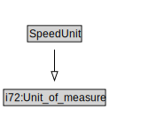

# SpeedUnit

<a href="diagrams/SpeedUnit.dot.svg">Open interactive SpeedUnit diagram</a>

## Formalization for SpeedUnit

| Property | Constraint |
|----------|------------|
| subClassOf | i72:Unit_of_measure |

