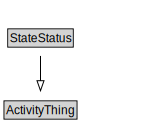

# StateStatus

<a href="diagrams/StateStatus.dot.svg">Open interactive StateStatus diagram</a>

## Formalization for StateStatus

| Property | Constraint |
|----------|------------|
| subClassOf | ActivityThing |

