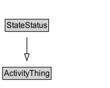

# StateStatus

## Diagram

=== "SVG (interactive)"

    <!-- Generated by graphviz version 14.0.2 (20251019.1705)
     -->
    <!-- Pages: 1 -->
    <svg width="166pt" height="132pt"
     viewBox="0.00 0.00 166.00 132.00" xmlns="http://www.w3.org/2000/svg" xmlns:xlink="http://www.w3.org/1999/xlink">
    <g id="graph0" class="graph" transform="scale(1 1) rotate(0) translate(4 128)">
    <polygon fill="white" stroke="none" points="-4,4 -4,-128 161.5,-128 161.5,4 -4,4"/>
    <g id="clust2" class="cluster">
    <title>cluster_associated</title>
    </g>
    <!-- StateStatus -->
    <g id="node1" class="node">
    <title>StateStatus</title>
    <g id="a_node1"><a xlink:href="../StateStatus" xlink:title="&lt;TABLE&gt;">
    <polygon fill="lightgray" stroke="none" points="4.75,-81.88 4.75,-98.12 68.25,-98.12 68.25,-81.88 4.75,-81.88"/>
    <text xml:space="preserve" text-anchor="start" x="5.75" y="-85.72" font-family="Arial" font-size="12.00">StateStatus</text>
    <polygon fill="none" stroke="black" points="3.75,-80.88 3.75,-99.12 69.25,-99.12 69.25,-80.88 3.75,-80.88"/>
    </a>
    </g>
    </g>
    <!-- ActivityThing -->
    <g id="node3" class="node">
    <title>ActivityThing</title>
    <g id="a_node3"><a xlink:href="../ActivityThing" xlink:title="&lt;TABLE&gt;">
    <polygon fill="lightgray" stroke="none" points="1,-9.88 1,-26.12 72,-26.12 72,-9.88 1,-9.88"/>
    <text xml:space="preserve" text-anchor="start" x="2" y="-13.72" font-family="Arial" font-size="12.00">ActivityThing</text>
    <polygon fill="none" stroke="black" points="0,-8.88 0,-27.12 73,-27.12 73,-8.88 0,-8.88"/>
    </a>
    </g>
    </g>
    <!-- StateStatus&#45;&gt;ActivityThing -->
    <g id="edge1" class="edge">
    <title>StateStatus&#45;&gt;ActivityThing</title>
    <path fill="none" stroke="black" d="M36.5,-72.05C36.5,-64.57 36.5,-55.58 36.5,-47.14"/>
    <polygon fill="none" stroke="black" points="40,-47.3 36.5,-37.3 33,-47.3 40,-47.3"/>
    </g>
    <!-- Invis -->
    </g>
    </svg>

=== "PNG"

    

## Formalization for StateStatus

| Property | Constraint |
|----------|------------|
| subClassOf | [ActivityThing](ActivityThing.md) |

