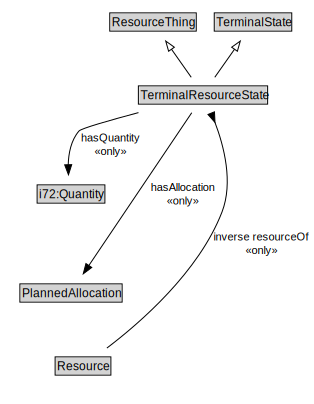

# TerminalResourceState

<a href="diagrams/TerminalResourceState.dot.svg">Open interactive TerminalResourceState diagram</a>

## Specializations of TerminalResourceState

| Class | Description |
|-------|-------------|
| [Consume State](ConsumeState.md) |  |
| [Produce State](ProduceState.md) |  |
| [Release State](ReleaseState.md) |  |
| [Use State](UseState.md) |  |

## Formalization for TerminalResourceState

| Property | Constraint |
|----------|------------|
| hasAllocation | all PlannedAllocation |
| hasQuantity | all i72:Quantity |
| inverse resourceOf | all Resource |
| subClassOf | TerminalState |
| subClassOf | ResourceThing |

## Used by classes

| Class | Property |
|-------|----------|
| [Agent (SpatialLocPattern)](Agent.md) | resourceOf |

