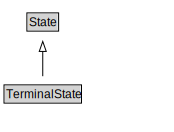

# TerminalState

<a href="diagrams/TerminalState.dot.svg">Open interactive TerminalState diagram</a>

## Specializations of TerminalState

| Class | Description |
|-------|-------------|
| [Consume State](ConsumeState.md) |  |
| [Manifestation State](ManifestationState.md) |  |
| [Produce State](ProduceState.md) |  |
| [Release State](ReleaseState.md) |  |
| [Terminal Resource State](TerminalResourceState.md) |  |
| [Use State](UseState.md) |  |

## Formalization for TerminalState

| Property | Constraint |
|----------|------------|
| subClassOf | State |

