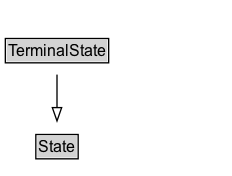

# TerminalState

## Diagram

=== "SVG (interactive)"

    <!-- Generated by graphviz version 14.0.2 (20251019.1705)
     -->
    <!-- Pages: 1 -->
    <svg width="174pt" height="132pt"
     viewBox="0.00 0.00 174.00 132.00" xmlns="http://www.w3.org/2000/svg" xmlns:xlink="http://www.w3.org/1999/xlink">
    <g id="graph0" class="graph" transform="scale(1 1) rotate(0) translate(4 128)">
    <polygon fill="white" stroke="none" points="-4,4 -4,-128 169.75,-128 169.75,4 -4,4"/>
    <g id="clust2" class="cluster">
    <title>cluster_associated</title>
    </g>
    <!-- TerminalState -->
    <g id="node1" class="node">
    <title>TerminalState</title>
    <g id="a_node1"><a xlink:href="../TerminalState" xlink:title="&lt;TABLE&gt;">
    <polygon fill="lightgray" stroke="none" points="1,-81.88 1,-98.12 76.5,-98.12 76.5,-81.88 1,-81.88"/>
    <text xml:space="preserve" text-anchor="start" x="2" y="-85.72" font-family="Arial" font-size="12.00">TerminalState</text>
    <polygon fill="none" stroke="black" points="0,-80.88 0,-99.12 77.5,-99.12 77.5,-80.88 0,-80.88"/>
    </a>
    </g>
    </g>
    <!-- State -->
    <g id="node3" class="node">
    <title>State</title>
    <g id="a_node3"><a xlink:href="../State" xlink:title="&lt;TABLE&gt;">
    <polygon fill="lightgray" stroke="none" points="23.88,-9.88 23.88,-26.12 53.62,-26.12 53.62,-9.88 23.88,-9.88"/>
    <text xml:space="preserve" text-anchor="start" x="24.88" y="-13.72" font-family="Arial" font-size="12.00">State</text>
    <polygon fill="none" stroke="black" points="22.88,-8.88 22.88,-27.12 54.62,-27.12 54.62,-8.88 22.88,-8.88"/>
    </a>
    </g>
    </g>
    <!-- TerminalState&#45;&gt;State -->
    <g id="edge1" class="edge">
    <title>TerminalState&#45;&gt;State</title>
    <path fill="none" stroke="black" d="M38.75,-72.05C38.75,-64.57 38.75,-55.58 38.75,-47.14"/>
    <polygon fill="none" stroke="black" points="42.25,-47.3 38.75,-37.3 35.25,-47.3 42.25,-47.3"/>
    </g>
    <!-- Invis -->
    </g>
    </svg>

=== "PNG"

    

## Specializations of TerminalState

| Class | Description |
|-------|-------------|
| [Consume State](ConsumeState.md) |  |
| [Manifestation State](ManifestationState.md) |  |
| [Produce State](ProduceState.md) |  |
| [Release State](ReleaseState.md) |  |
| [Terminal Resource State](TerminalResourceState.md) |  |
| [Use State](UseState.md) |  |

## Formalization for TerminalState

| Property | Constraint |
|----------|------------|
| subClassOf | [State](State.md) |

