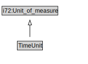

# TimeUnit

<a href="diagrams/TimeUnit.dot.svg">Open interactive TimeUnit diagram</a>

## Formalization for TimeUnit

| Property | Constraint |
|----------|------------|
| subClassOf | i72:Unit_of_measure |

## Used by classes

| Class | Property |
|-------|----------|
| [Cardinality Unit Per Time](CardinalityUnitPerTime.md) | i72:denominator |

