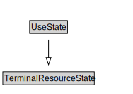

# UseState

<a href="diagrams/UseState.dot.svg">Open interactive UseState diagram</a>

## Formalization for UseState

| Property | Constraint |
|----------|------------|
| subClassOf | TerminalResourceState |

