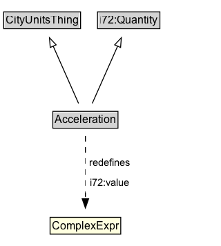

# Acceleration

## Diagram

=== "SVG (interactive)"

    <!-- Generated by graphviz version 14.1.3 (20260303.0454)
     -->
    <!-- Pages: 1 -->
    <svg width="240pt" height="267pt"
     viewBox="0.00 0.00 240.00 267.00" xmlns="http://www.w3.org/2000/svg" xmlns:xlink="http://www.w3.org/1999/xlink">
    <g id="graph0" class="graph" transform="scale(1 1) rotate(0) translate(4 263)">
    <polygon fill="white" stroke="none" points="-4,4 -4,-263 235.75,-263 235.75,4 -4,4"/>
    <g id="clust3" class="cluster">
    <title>cluster_associated</title>
    </g>
    <!-- CityUnitsThing -->
    <g id="node1" class="node">
    <title>CityUnitsThing</title>
    <g id="a_node1"><a xlink:href="../CityUnitsThing" xlink:title="&lt;TABLE&gt;">
    <polygon fill="lightgray" stroke="none" points="1,-232.88 1,-249.12 82.5,-249.12 82.5,-232.88 1,-232.88"/>
    <text xml:space="preserve" text-anchor="start" x="2" y="-236.88" font-family="Arial" font-size="12.00">CityUnitsThing</text>
    <polygon fill="none" stroke="black" points="0,-231.88 0,-250.12 83.5,-250.12 83.5,-231.88 0,-231.88"/>
    </a>
    </g>
    </g>
    <!-- i72_Quantity -->
    <g id="node2" class="node">
    <title>i72_Quantity</title>
    <g id="a_node2"><a xlink:href="https://w3id.org/citydata/21972/v1/Quantity" xlink:title="&lt;TABLE&gt;">
    <polygon fill="lightgray" stroke="none" points="102.88,-232.88 102.88,-249.12 168.62,-249.12 168.62,-232.88 102.88,-232.88"/>
    <text xml:space="preserve" text-anchor="start" x="103.88" y="-236.88" font-family="Arial" font-size="12.00">i72:Quantity</text>
    <polygon fill="none" stroke="black" points="101.88,-231.88 101.88,-250.12 169.62,-250.12 169.62,-231.88 101.88,-231.88"/>
    </a>
    </g>
    </g>
    <!-- Acceleration -->
    <g id="node3" class="node">
    <title>Acceleration</title>
    <g id="a_node3"><a xlink:href="../Acceleration" xlink:title="&lt;TABLE&gt;">
    <polygon fill="lightgray" stroke="none" points="54.38,-124.88 54.38,-141.12 123.12,-141.12 123.12,-124.88 54.38,-124.88"/>
    <text xml:space="preserve" text-anchor="start" x="55.38" y="-128.88" font-family="Arial" font-size="12.00">Acceleration</text>
    <polygon fill="none" stroke="black" points="53.38,-123.88 53.38,-142.12 124.12,-142.12 124.12,-123.88 53.38,-123.88"/>
    </a>
    </g>
    </g>
    <!-- Acceleration&#45;&gt;CityUnitsThing -->
    <g id="edge1" class="edge">
    <title>Acceleration&#45;&gt;CityUnitsThing</title>
    <path fill="none" stroke="black" d="M81.3,-150.8C73.89,-167.51 62.4,-193.42 53.71,-213.02"/>
    <polygon fill="none" stroke="black" points="50.56,-211.49 49.71,-222.05 56.96,-214.33 50.56,-211.49"/>
    </g>
    <!-- Acceleration&#45;&gt;i72_Quantity -->
    <g id="edge2" class="edge">
    <title>Acceleration&#45;&gt;i72_Quantity</title>
    <path fill="none" stroke="black" d="M96.2,-150.8C103.61,-167.51 115.1,-193.42 123.79,-213.02"/>
    <polygon fill="none" stroke="black" points="120.54,-214.33 127.79,-222.05 126.94,-211.49 120.54,-214.33"/>
    </g>
    <!-- na010c749982e452794368b522251db07b2 -->
    <g id="node5" class="node">
    <title>na010c749982e452794368b522251db07b2</title>
    <polygon fill="lightyellow" stroke="none" points="50.38,-8.88 50.38,-27.12 127.12,-27.12 127.12,-8.88 50.38,-8.88"/>
    <text xml:space="preserve" text-anchor="start" x="52.38" y="-13.88" font-family="Arial" font-size="12.00">ComplexExpr</text>
    <polygon fill="none" stroke="black" points="50.38,-8.88 50.38,-27.12 127.12,-27.12 127.12,-8.88 50.38,-8.88"/>
    </g>
    <!-- Acceleration&#45;&gt;na010c749982e452794368b522251db07b2 -->
    <g id="edge3" class="edge">
    <title>Acceleration&#45;&gt;na010c749982e452794368b522251db07b2</title>
    <path fill="none" stroke="black" stroke-dasharray="5,2" d="M88.75,-115.33C88.75,-97.38 88.75,-68.54 88.75,-47.08"/>
    <polygon fill="black" stroke="black" points="92.25,-47.26 88.75,-37.26 85.25,-47.26 92.25,-47.26"/>
    <polygon fill="white" stroke="none" points="88.75,-54 88.75,-97 141,-97 141,-54 88.75,-54"/>
    <text xml:space="preserve" text-anchor="start" x="92.75" y="-82.5" font-family="Arial" font-size="11.00">redefines</text>
    <text xml:space="preserve" text-anchor="start" x="93.5" y="-61" font-family="Arial" font-size="11.00">i72:value</text>
    </g>
    <!-- Invis -->
    </g>
    </svg>

=== "PNG"

    

## Formalization for Acceleration

| Property | Constraint |
|----------|------------|
| subClassOf | [i72:Quantity](i72:Quantity.md) |
| subClassOf | [CityUnitsThing](CityUnitsThing.md) |

