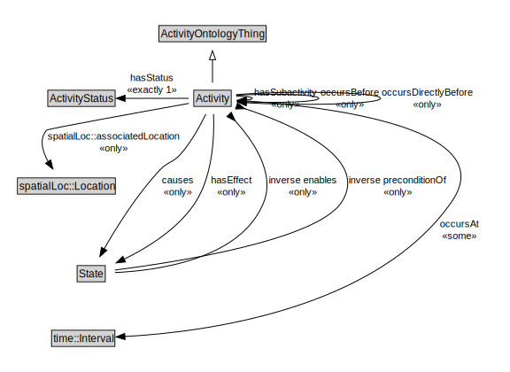

# Activity

<a href="../../diagrams/Activity__Activity.dot.svg">Open interactive Activity diagram</a>

## Formalization for Activity

| Property | Constraint |
|----------|------------|
| causes | all State |
| hasEffect | all State |
| hasStatus | exactly 1 owl::Thing |
| hasSubactivity | all Activity |
| inverse enables | all State |
| inverse preconditionOf | all State |
| occursAt | some time::Interval |
| occursBefore | all Activity |
| occursDirectlyBefore | all Activity |
| spatialLoc::associatedLocation | all spatialLoc::Location |
| subClassOf | ActivityOntologyThing |

## Used by classes

| Class | Property |
|-------|----------|
| [Activity (Activity)](Activity__Activity.md) | hasSubactivity |
| [Activity (Activity)](Activity__Activity.md) | occursBefore |
| [Activity (Activity)](Activity__Activity.md) | occursDirectlyBefore |
| [State (Activity)](Activity__State.md) | causedBy |
| [State (Activity)](Activity__State.md) | effectOf |
| [State (Activity)](Activity__State.md) | enables |
| [State (Activity)](Activity__State.md) | preconditionOf |

