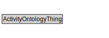

# ActivityOntologyThing

<a href="../../diagrams/Activity__ActivityOntologyThing.dot.svg">Open interactive ActivityOntologyThing diagram</a>

## Specializations of ActivityOntologyThing

| Class | Description |
|-------|-------------|
| [Activity (Activity)](Activity__Activity.md) |  |
| [Activity Status (Activity)](Activity__ActivityStatus.md) |  |
| [Conjunctive State (Activity)](Activity__ConjunctiveState.md) |  |
| [Disjunctive State (Activity)](Activity__DisjunctiveState.md) |  |
| [Manifestation State (Activity)](Activity__ManifestationState.md) |  |
| [Non Terminal State (Activity)](Activity__NonTerminalState.md) |  |
| [State (Activity)](Activity__State.md) |  |
| [State Status (Activity)](Activity__StateStatus.md) |  |
| [Terminal State (Activity)](Activity__TerminalState.md) |  |

